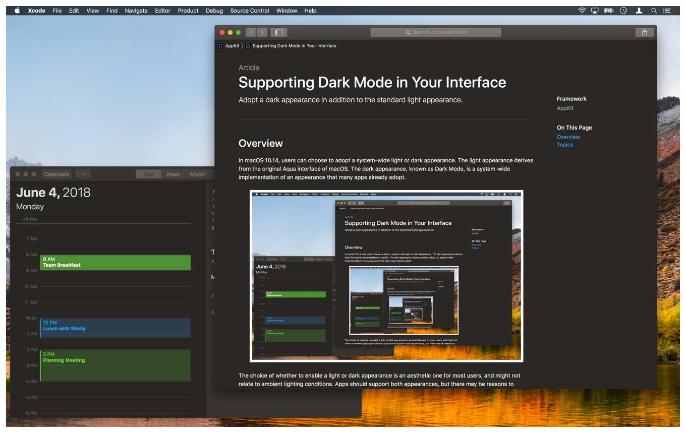
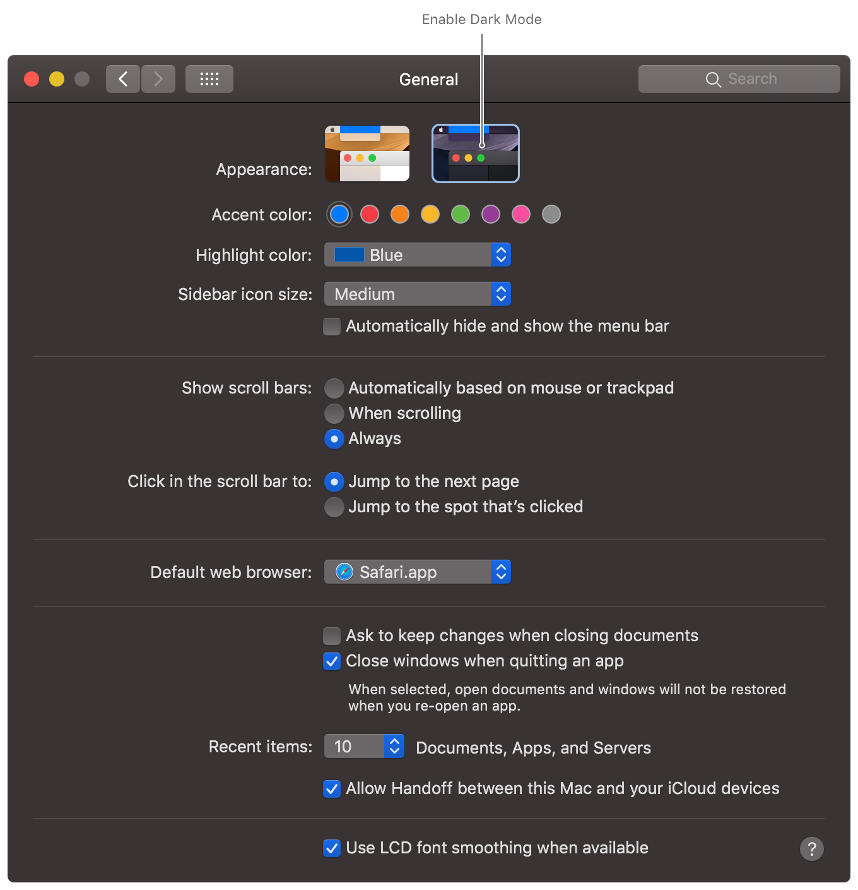
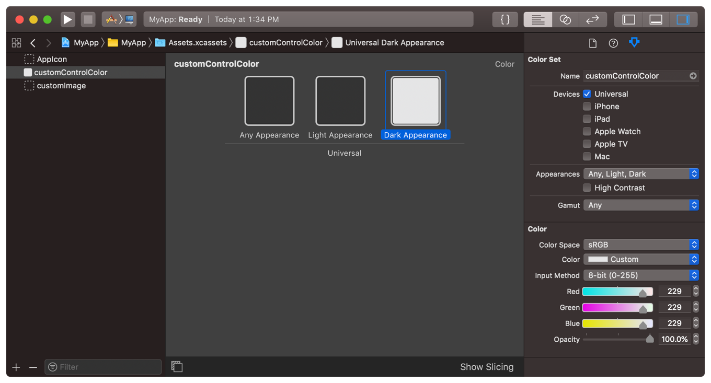

# 在界面中支持深色模式

更新颜色，图像和行为，以便在启用深色模式时自动适应你的应用。

## 概述

在macOS和iOS中，用户可以选择采用系统范围的浅色或深色外观。深色外观（称为深色模式）实现了许多应用程序已经采用的界面样式。用户可以选择自己喜欢的美学，还可以根据环境照明条件或特定时间表来选择切换界面。



所有应用程序均应支持深浅模式样式，但在某些地方具有特定外观时可能会表现更好。例如，对于打印的内容，你可能始终采用浅色外观。

在更改代码之前，请打开“深色模式”，然后查看你的应用如何响应。该系统为你完成了很多工作，如果你的应用程序使用标准视图和控件，则可能不需要进行很多更改。标准视图和控件会自动更新其外观以匹配当前界面样式。如果你已经在使用颜色和图像资源，则可以添加深色变体而无需更改代码。



### 为你的UI选择自适应颜色

选择自动适应基础界面样式的颜色。浅色和深色界面使用非常不同的调色板。在浅色外观中效果良好的颜色在深色外观中可能很难看到，反之亦然。自适应颜色对象针对不同的界面样式返回不同的颜色值。

有两种创建自适应颜色对象的方法：

* 选择语义颜色而不是固定颜色值。配置UI元素时，请选择像`labelColor`之类有名称的颜色。这些语义颜色传达了颜色的预期用途，而不是特定的颜色值。当你将它们用于预期目的时，它们将使用适合当前设置的颜色值进行渲染。有关语义颜色名称的完整列表，请参见[NSColor]()和[UIColor]()。

* 在Asset目录中定义自定义颜色。需要特定颜色时，将其创建为Color Asset，并且在Asset中，为浅色和深色外观指定不同的颜色值。你还可以指定颜色的高对比度版本。

你可以使用Xcode的Asset编辑器配置自定义Color Asset。将Color Set Asset添加到项目中，并配置要修改的外观变量。使用“Any Appearance”变量来指定在不支持深色模式的较旧系统上使用的颜色值。



要从Asset目录中加载颜色值，请按名称加载颜色：

```swift
// macOS
let aColor = NSColor(named: NSColor.Name("customControlColor"))

// iOS
let aColor = UIColor(named: "customControlColor")
```

从Color Asset创建颜色对象时，当前外观更改时不必重新创建该对象。每次为绘图设置填充或描边颜色时，颜色对象都会加载与当前环境设置匹配的颜色变量。 对于语义颜色（例如`labelColor`）也是如此，它们会自动适应当前环境。相比之下，你使用固定的组件值创建的颜色对象则无法适应。你必须创建一个新的颜色对象。

> **注意**
> 
> 对于用户自己的内容，请始终保留用户明确选择的颜色。例如，绘画应用程序不应尝试更改用户应用于其画布的颜色。主要在应用程序的Chrome浏览器的视图和控件中使用自适应颜色。

### 为所有外观创建图像

确保界面中的图像在深浅模式下都看起来不错。界面在许多地方使用图像，包括按钮，图像视图以及自定义视图和控件。如果更改外观时难以看到图像，请提供在其他外观上看起来不错的新Image Asset。更好的是，使用Symbol Image或Template Image，它们仅定义要渲染的形状，因此对于亮，暗和高对比度环境不需要单独的图像。

有关为浅色和深色界面配置图像的信息，请参阅[为不同外观提供图像]()。

### 使用特定方法更新自定义视图

当用户更改系统外观时，系统会自动要求每个Window和View重绘自身。在此过程中，系统将为macOS和iOS调用下表中列出的几种众所周知的方法来更新你的内容。系统在调用这些方法之前会更新特征环境，因此，如果你对它们进行了所有外观敏感的更改，则你的应用程序会正确更新。

| 类 | 对应的方法 |
|:---:|:-------|
| [NSView]() | [updateLayer()]()<br>[draw(_:)]()<br>[layout()]()<br>[updateConstraints()]() |
| [UIView]() | [traitCollectionDidChange(_:)]()<br>[layoutSubviews()]()<br>[draw(_:)]()<br>[updateConstraints()]()<br>[tintColorDidChange()]() |
| [UIViewController]() | [traitCollectionDidChange(_:)]()<br>[updateViewConstraints()]()<br>[viewWillLayoutSubviews()]()<br>[viewDidLayoutSubviews()]() |
| [UIPresentationController]() | [traitCollectionDidChange(_:)]()<br>[containerViewWillLayoutSubviews()]()<br>[containerViewDidLayoutSubviews()]() |

如果你在这些方法之外进行外观敏感的更改，则你的应用可能无法针对当前环境正确绘制其内容。解决方案是将代码移入这些方法。例如，不要在创建时设置[NSView]()对象层的背景色，而是将代码移到View的[updateLayer()]方法中，如下面的代码示例所示。在创建时设置背景颜色似乎是适当的，但是由于[CGColor]()对象无法适应，因此在创建时设置背景颜色会使视图具有固定的背景颜色，并且永远不变。将代码移动到[updateLayer()]()，每当环境变化时，都会刷新该背景色。

```swift
override func updateLayer() {
   self.layer?.backgroundColor = NSColor.textBackgroundColor.cgColor

   // Other updates.
}
```
	
### 根据预期用途选择视觉效果材料

Visual-effect View为背景View增加了透明度，与背景不透明的情况相比，UI的视觉深度更大。为了确保你的内容依然可见，Visual-effect View巧妙地模糊了背景内容，并添加了鲜艳效果以自动调整前景内容的颜色。系统会动态更新这些效果，以确保当基础内容更改时，你的应用程序内容仍然可见。

在界面中使用Visual-effect View作为Container View，并向其添加子视图以表示前景内容。使用适合你想要的外观的材质或效果配置每个Visual-effect View：

* 在macOS中，根据你在界面中使用该视图的方式，使用适当的材料配置[NSVisualEffectView]()。例如，当使用Visual-effect View作为侧边栏界面的背景时，请使用[NSVisualEffectView.Material.sidebar]()材质对其进行配置。

* 在iOS中，将[UIVisualEffectView]()配置为具有特定的鲜艳度和模糊效果，以创建所需的外观。模糊效果定义了背景View的外观厚度，鲜艳度效果会调整特定类型内容的外观，以确保它们依然可见。例如，当你的视图包含标签时，请选择[UIVibrancyEffectStyle.label]()样式或其他与标签相关的鲜艳度选项之一。

> **重要**
> 
> 在macOS 10.14及更高版本中，请勿使用已弃用的材料，例如[NSVisualEffectView.Material.light]()，因为这些材料不适用于深色模式而是选择适合环境的新材料。

### 仅根据需要选择退出

尽一切努力在应用程序中采用浅色和深色外观。如果支持一种外观对于整个应用程序或部分应用程序都没有意义，则可以在适当的窗口或视图中选择退出外观更改。例如，你可能始终在应用程序的打印视图中使用浅色外观。

你可以将界面的全部或部分配置为退出特定外观。你还可以为整个应用采用特定外观。有关更多信息，请参见以下内容：

* [为macOS应用选择特定的外观](./choosing_a_specific_appearance_for_your_macos_app.md)

* [为您的iOS应用选择特定的界面样式]()

### 在外观转换过程中避免耗时的任务

当用户在深浅界面之间切换时，系统会要求你的应用重新绘制其所有内容。尽管系统管理绘制过程，但在该过程中的某些时候它仍依赖于你的自定义代码。你的代码必须尽可能快，并且不能执行与外观更改无关的任务。在macOS中，AppKit通常会在外观更改时创建过渡动画，但是如果你的应用花费太长时间来重新绘制自身，它将终止这些动画。

## 主题

### 外观支持

* [为macOS应用选择特定的外观](./choosing_a_specific_appearance_for_your_macos_app.md)

当不适合同时支持浅色和深色模式时，请为你的Window，View或应用程序采用特定的外观。

* [为您的iOS应用选择特定的界面样式]()

当不适合同时支持浅色和深色模式时，请为View，View Controller或应用程序采用特定的界面样式。

### 图像

* [为不同外观提供图像]()

提供适用于浅色和深色外观以及高对比度环境的图像资源。

* [在UI中配置和显示Symbol Image]()

创建可与你的应用文本完美融合的可缩放图像，并动态调整这些图像的外观。