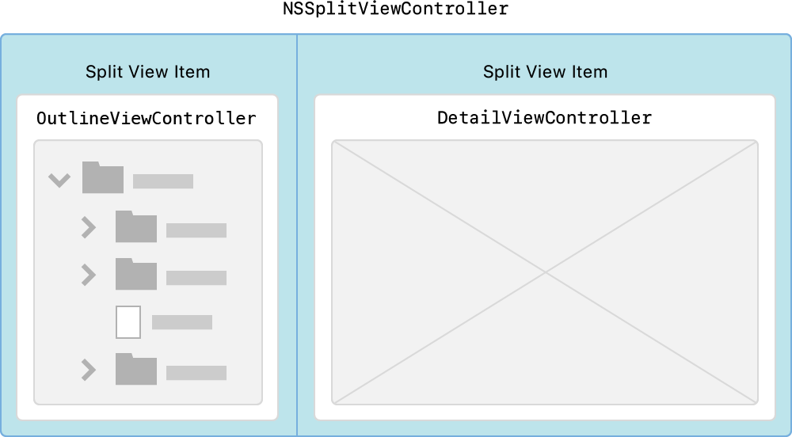
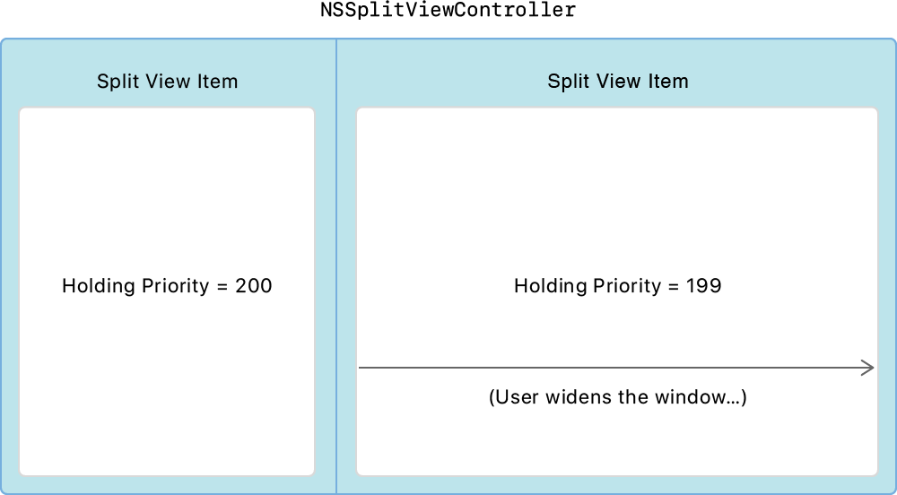

# 使用`Outline View`和`Split View`导航分层数据

使用`Cocoa Bindings`自动将数据模型与应用程序界面同步。

> **[Demo](https://docs-assets.developer.apple.com/published/78395ef69d/NavigatingHierarchicalDataUsingOutlineAndSplitViews.zip)**

## 概述

就像`Table View`线性地组织对象列表一样，`Outline View`也可以层次化地组织对象。当App的用户界面变得更加复杂时，`Outline`格式可以帮助保持组织状态。

此示例显示如何使用[NSOutlineView]()导航层次结构数据。`NSOutlineView`是使用行和列格式的`Cocoa View`。行被扩展和折叠以控制所提供的信息量。`Outline`是一个分层的图像列表，被分组到容器中。该层次结构是在`DataSource.plist`文件中预定义的。

`Outline View`使用[NSTableView.SelectionHighlightStyle.sourceList]()用于：

* 用比默认颜色浅的蓝色表示行被选中。

* 分组节点，外观类似于Finder的侧边栏。

* 模糊的背景内容可增加界面的深度。

它通过在`Storyboard`中设置突出显示外观来实现此目的，但是你也可以在代码中对其进行配置：

```swift
outlineView.selectionHighlightStyle = .sourceList
```

当那你将[NSOutlineView]()与[NSSplitViewController]()一起使用时，你的应用程序将以主从格式显示数据，类似于`Xcode`项目中的导航器或Finder。

### 配置`Split View Controller`

`Outline View`可以很好地用作主从用户界面的一部分。当用户从左侧的`Outline View`中选择一个项目时，详细视图将显示选择的结果。对于主从配置，请使用[NSSplitView]()，它在水平运行的线性堆栈中排列两个或多个`View`。每个`View`都嵌入其自己的[NSSplitViewItem]()中。在此示例项目中，左侧的`Split View Item`是一个名为`OutlineViewController`的`View Controller`，右侧的`Split View Item`是`DetailViewController`。`OutlineViewController`类重点介绍如何使用`NSOutlineView`。



在主从用户界面中，当`Split View`增大或缩小时，左侧的列表视图必须保持相同的大小，而右侧的详细信息视图更改大小。为了实现此行为，App对`Split View Item`使用了*保留优先级*：保留优先级最低的`View`是第一个在`Split View`增大或缩小时调整宽度的视图。为了防止左侧`Split View Item`增大，请将其持有优先级设置为200，并将右侧的`Item`设置为199。



### 使用`Tree Controller`定义分层内容

[NSTreeController]()类是`Outline View`的数据源。 将`NSOutlineView`绑定到其对象的层次结构集合时，它充当控制器。这些对象代表由Node类实现的节点。

本示例使用两种节点：

* 基于URL，表示在磁盘上找到的容器或文档。

* 基于非URL，仅表示在内存中找到的容器或文档。

节点可以代表容器或文档。容器节点将其他节点分组在一起。每个容器节点都有其自己的唯一标识符，而文档节点具有一个空的标识符，没有子代。

```swift
class Node: NSObject, Codable {
    var type: NodeType = .unknown
    var title: String = ""
    var identifier: String = ""
    var url: URL?
    @objc dynamic var children = [Node]()
}
```

层次结构包含从`DataSource.plist`文件读取的节点。节点对象采用`Decodable`协议，并直接从属性列表文件中自动创建。

```swift
guard let newPlistURL = Bundle.main.url(forResource: "DataSource", withExtension: "plist") else {
    fatalError("Failed to resolve URL for `DataSource.plist` in bundle.")
}
do {
    // Populate the outline view with the plist content.
    struct OutlineData: Decodable {
        let children: [Node]
    }
    // Decode the top-level children of the outline.
    let plistDecoder = PropertyListDecoder()
    let data = try Data(contentsOf: newPlistURL)
    let decodedData = try plistDecoder.decode(OutlineData.self, from: data)
    for node in decodedData.children {
        // Recursively add further content from the given node.
        addNode(node)
        if node.type == .container {
            selectParentFromSelection()
        }
    }
} catch {
    fatalError("Failed to load `DataSource.plist` in bundle.")
}
```

### 处理拖放

用户从`Outline View`中拖放节点以重新排列它们，或将表示图像的节点拖到其他App中。用户还可以从Finder，照片，邮件或Safari中拖入图像文件。有关更多信息，请参见[拖放]()。此示例显示如何通过使用[NSFilePromiseProvider]()拖出图像文件的副本来创建承诺拖动。

### 添加上下文菜单

`Outline View`使用上下文菜单或快捷菜单，它们提供了对常用命令的访问。按住Control键单击或右键单击`Outline View`节点，将打开其上下文菜单。`NSOutlineView`的[menu(for:)]()函数创建这些上下文菜单。使用`NSOutlineView`子类重写此函数以返回上下文菜单。上下文菜单操作是添加，删除和重命名。

### 集成编辑菜单

你可以使用`Edit`菜单直接影响`Outline View`的内容。此示例添加了一个`Delete`菜单项，用于从`Outline View`中删除项目。`OutlineViewController`实现了`IBAction`删除功能，因此用户可以选择菜单项或按Delete键。

```swift
// User chose the Delete menu item or pressed the delete key.
@IBAction func delete(_ sender: AnyObject) {
    removeItems()
}
```

你可以使用[NSUserInterfaceValidations]()协议根据`Outline View`中显示的选择启用或禁用“删除”菜单项。

```swift
func validateUserInterfaceItem(_ item: NSValidatedUserInterfaceItem) -> Bool {
    if item.action == #selector(delete(_:)) {
        return !treeController.selectedObjects.isEmpty
    }
    return true
}
```

### 恢复`Outline View`

此示例为保存并还原：

* `Outline View`的选择。
* 每个容器节点的显示状态。

你可以使用窗口恢复系统的[encodeRestorableState(with:)]()函数来保存`Outline View`的节点选择。下次启动该应用程序时，请使用[restoreState(with:)]()还原该选择。

当`Outline View`保存显示状态时，它通过使用`persistentObjectForItem`函数将每个容器编码为已归档对象。

```swift
func outlineView(_ outlineView: NSOutlineView, persistentObjectForItem item: Any?) -> Any? {
    let node = OutlineViewController.node(from: item!)
    return node?.identifier // Outgoing object is the identifier.
}
```

`Outline View`恢复显示状态时，将为每个`View`调用此函数，以将存档对象转换为`Outline View Item`：

```swift
func outlineView(_ outlineView: NSOutlineView, itemForPersistentObject object: Any) -> Any? {
    let node = nodeFromIdentifier(anObject: object)  // Incoming object is the identifier.
    return node
}
```