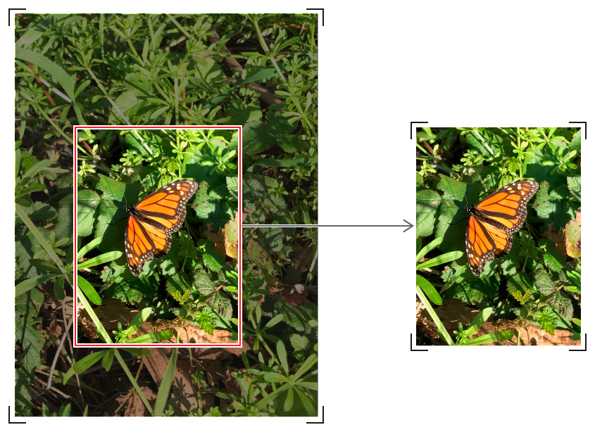

# imageByCroppingToRect:

返回一个包含原始图像裁剪部分的新图像。

| SDK | Version |
|:---:|:---:|
| iOS | 5.0+ |
| macOS | 10.5+ |
| tvOS | 9.0+ |

---

## 声明

```objective-c
/* Objective-C */
- (CIImage *)imageByCroppingToRect:(CGRect)rect;
```

```swift
/* Swift */

```

---

## 参数

* **rect**

    图像坐标中用于裁剪图像的矩形。

---

## 返回值

一个裁剪到指定矩形的图像对象。



---

## 说明

由于Core Image的坐标系与[UIKit]()不匹配，当使用[contentMode]()在[UIImageView]()中显示时，此过滤方法可能会产生意外结果。请务必使用[CGImage]()对其进行备份，以便正确处理[contentMode]()。

```objective-c
/* Objective-C */
CIContext* context = [CIContext context];
CGImageRef cgCroppedImage = [context createCGImage:ciCroppedImage fromRect:ciCroppedImage.extent];
UIImage* croppedImage = [UIImage imageWithCGImage:cgCroppedImage];
CGImageRelease(cgCroppedImage);
```

```swift
/* Swift */

```

如果你主要以[CGImageRef]()或[UIImage]()显示或处理图像，而没有额外的Core Image应用程序，请考虑使用[CGImageCreateWithImageInRect]()函数在Core Graphics中裁剪，以节省从图像转换到CIImage的处理开销。当你的管道中已经有[CIImage]()时最好是使用[imageByCroppingToRect:](./imageByCroppingToRect.md)。