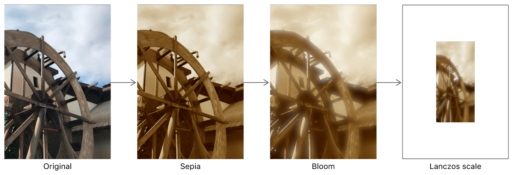

# 使用内置过滤器(Filter)处理图像

为图像应用棕褐色调，高光强化和缩放等效果(Effect)。

---

## 概述

你可以通过将Core Image过滤器(Filter)应用于[CIImage]()对象来为图像添加效果。图1显示了三个链接在一起的过滤器(Filter)，用以实现累积效果：

* 使用sepia过滤器(Filter)对带有红褐色色调的图像进行着色。

* 添加bloom过滤器(Filter)以强化高光。

* 使用Lanczos scale过滤器(Filter)按比例缩小图像。



### 创建一个上下文(Context)

[CIImage]()处理发生在[CIContext]()对象中。创建[CIContext]()非常消耗性能，因此只需要在你应用程序的初始设置期间创建一个并在整个应用程序中重复使用它。

```objective-c
/* Objective-C */
CIContext* context = [CIContext context];
```

```swift
/* Swift */
let context = CIContext()
```

### 加载一个需要处理的图像

下一步是加载图像进行处理。此示例从项目bundle中加载图像。

```objective-c
/* Objective-C */
NSURL* imageURL = [[NSBundle mainBundle] URLForResource:@"YourImageName" withExtension:@"png"];
CIImage* originalCIImage = [CIImage imageWithContentsOfURL:imageURL];
self.imageView.image = [UIImage imageWithCIImage:originalCIImage];
```

```swift
/* Swift */
let imageURL = URL(fileURLWithPath: "\(Bundle.main.bundlePath)/YourImageName.png")
let originalCIImage = CIImage(contentsOf: imageURL)!
self.imageView.image = UIImage(ciImage:originalCIImage)
```

[CIImage]()对象本身不是可显示的图像，而是图像数据。要显示它，你必须将其转换为其他类型，例如[UIImage]()。

### 应用内置的Core Image过滤器(Filter)

一个[CIFilter]()表示特定效果的单个操作或步骤。要处理[CIImage]()对象，请将其传递给[CIFilter]()对象。你可以子类化[CIFilter]()或从现有的内置过滤器(Filter)库中进行选择绘制。

> **注意**
> 
> 内置过滤器(Filter)不是具有可见属性的单独类类型。你必须事先知道他们的名字和输入参数; 有关过滤器(Filter)及其效果的列表，请参阅[Core Image过滤器(Filter)参考]()。一些更常见的输入参数类型具有关联的键，例如[kCIInputImageKey]()。如果无法推断关联的键常量，则只需使用过滤器(Filter)参考中的字符串文字即可。


#### 使用Sepia过滤器(Filter)渲染红褐色

虽然你可以链接过滤器而不将它们分离为单个函数，但以下示例显示了如何配置单个[CIFilter]()，即`CISepiaTone`过滤器(Filter)。

```objective-c
/* Objective-C */
- (CIImage*) sepiaFilterImage: (CIImage*)inputImage withIntensity:(CGFloat)intensity
{
    CIFilter* sepiaFilter = [CIFilter filterWithName:@"CISepiaTone"];
    [sepiaFilter setValue:inputImage forKey:kCIInputImageKey];
    [sepiaFilter setValue:@(intensity) forKey:kCIInputIntensityKey];
    return sepiaFilter.outputImage;
}
```

```swift
/* Swift */
func sepiaFilter(_ input: CIImage, intensity: Double) -> CIImage?
{
    let sepiaFilter = CIFilter(name:"CISepiaTone")
    sepiaFilter?.setValue(input, forKey: kCIInputImageKey)
    sepiaFilter?.setValue(intensity, forKey: kCIInputIntensityKey)
    return sepiaFilter?.outputImage
}
```

要通过过滤器(Filter)传递图像，请调用sepia过滤器(Filter)功能。

```objective-c
/* Objective-C */
CIImage* sepiaCIImage = [self sepiaFilterImage:originalCIImage withIntensity:0.9];
```

```swift
/* Swift */

```

你可以通过将[CIImage]()转换为用户界面可显示的[UIImage]()，并将[UIImage]()分配给视图层次结构中的[UIImageView]()，来检查过滤器(Filter)链处理过程中任何一个中间结果。

```objective-c
/* Objective-C */
_imageView.image = [UIImage imageWithCIImage:sepiaCIImage];
```

```swift
/* Swift */

```

#### 使用Bloom过滤器(Filter)强化高光

Bloom过滤器(Filter)强化了图像的高光。你可以将其作为链的一部分来使用，而不是将其分解为单独的函数做处理，但此示例将其功能封装在单独的函数中。

```objective-c
/* Objective-C */
- (CIImage*) bloomFilterImage: (CIImage*)inputImage withIntensity:(CGFloat)intensity radius:(CGFloat)radius
{
    CIFilter* bloomFilter = [CIFilter filterWithName:@"CIBloom"];
    [bloomFilter setValue:inputImage forKey:kCIInputImageKey];
    [bloomFilter setValue:@(intensity) forKey:kCIInputIntensityKey];
    [bloomFilter setValue:@(radius) forKey:kCIInputRadiusKey];
    return bloomFilter.outputImage;
}
```

```swift
/* Swift */

```

像Sepia过滤器(Filter)一样，Bloom过滤器(Filter)效果的强度范围在0到1之间，其中1是最强烈的效果。Bloom过滤器(Filter)具有额外的`inputRadius`参数，以确定发光区域将扩展多少。尝试使用范围值来微调效果，或者将输入参数分配给控件（如[UISlider]()）以允许用户调整其值。

> **注意**
> 
> `CIGloom`过滤器(Filter)的效果正好相反。

要显示输出，请将[CIImage]()转换为[UIImage]()。

```objective-c
/* Objective-C */
CIImage* bloomCIImage = [self bloomFilterImage:sepiaCIImage withIntensity:1 radius:10];
_filteredImageView.image = [UIImage imageWithCIImage:bloomCIImage];
```

```swift
/* Swift */

```


#### 使用Lanczos Scale过滤器(Filter)缩放图像

应用`CILanczosScaleTransform`以获得图像的高质量采样，通过`CILanczosScaleTransform`过滤器(Filter)的输入参数`aspectRatio`保留原始图像的纵横比。对于内置的Core Image过滤器(Filter)，请将按照图像的高度宽度计算纵横比，如下面代码所示。

```objective-c
/* Objective-C */
CGFloat imageWidth = originalUIImage.size.width;
CGFloat imageHeight = originalUIImage.size.height;
CGFloat aspectRatio = imageHeight / imageWidth;
CIImage* scaledCIImage = [self scaleFilterImage:bloomCIImage withAspectRatio:aspectRatio scale:0.05];
```

```swift
/* Swift */

```

与其他内置过滤器(Filter)一样，`CILanczosScale`过滤器(Filter)也将其结果输出为[CIImage]()。

```objective-c
/* Objective-C */
- (CIImage*) scaleFilterImage: (CIImage*)inputImage withAspectRatio:(CGFloat)aspectRatio scale:(CGFloat)scale
{
    CIFilter* scaleFilter = [CIFilter filterWithName:@"CILanczosScaleTransform"];
    [scaleFilter setValue:inputImage forKey:kCIInputImageKey];
    [scaleFilter setValue:@(scale) forKey:kCIInputScaleKey];
    [scaleFilter setValue:@(aspectRatio) forKey:kCIInputAspectRatioKey];
    return scaleFilter.outputImage;
}
```

```swift
/* Swift */

```

> **重要**
> 
> 为了优化计算，在你强制[CIImage]()在屏幕上显示其内容之前，Core Image实际上不会呈现任何中间[CIImage]()结果，就像你使用[UIImageView]()一样。

```objective-c
/* Objective-C */
_imageView.image = [UIImage imageWithCIImage:scaledCIImage];
```

```swift
/* Swift */

```

> **注意**
> 
> 在链接调用时，Core Image会通过重新排序三个链接过滤器(Filter)并将它们连接成一个图像处理内核来优化处理过程，从而节省计算和渲染周期。

除了尝试固定效果的内置过滤器(Filter)之外，你还可以在某些过滤器(Filter)链式调用中通过组合过滤器(Filter)来完成诸如[应用色度键效果]()，[选择性地聚焦图像]()，[自定义图像过渡]()以及[模拟老式胶片]()等任务。

---

## 查看其他

