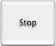
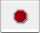
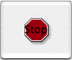
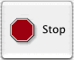
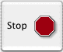
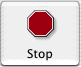

# 设置`Button`的图像

一个`按钮`可以具有两个与之关联的图像：`Normal`和`Alternate`。 如果`按钮`类型为`NSMomentaryPushInButton`，`NSPushOnPushOffButton`，`NSMomentaryLightButton`或`NSOnOffButton`，则仅显示`Normal`图像。如果`按钮`类型为`NSMomentaryChangeButton`或`NSToggleButton`，则在`按钮`状态为关闭（`NSOffState`）时显示`Normal`图像，而在`按钮`状态为打开或混合状态（`NSOnState`或`NSMixedState`）时显示`Alternate`图像。如果希望`按钮`在所有三种状态下显示不同的图像，则必须子类化`NSButton`。（尽管`开关`和`单选按钮`可以在所有三种状态下显示不同的图像，但是此功能没有公开的设置接口。）

要设置`Normal`图像，请使用`setImage:`。要设置`Alternate`图像，请使用`setAlternateImage:`。

> **注意：** 如果`按钮`是`复选框`或`单选按钮`，请勿更改其图像。这些`按钮`的图像是系统定义的，更改它们可能会导致不可预测的结果。如果要使`开关`或`单选按钮`具有自定义外观，请自定义`Toggle Button`（类型为`NSToggleButton`的`按钮`）或子类化`NSButton`。

要设置`按钮`图像的位置，请使用`setImagePosition:`，并使用以下值之一。默认值为`NSNoImage`

* `NSNoImage`

* `NSImageOnly`

* `NSImageOverlaps`

* `NSImageLeft`

* `NSImageRight`

* `NSImageBelow`

* `NSImageAbove`

