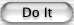

# Setting the Appearance of a Button’s Border

你可以通过更改按钮的形状和阴影来控制按钮的边框。请注意，如果`isBordered`返回`false`，则边框不会出现。使用[setBordered:]()更改其值。

要更改边框的形状，请使用[setBezelStyle:]()更改按钮的边框类型。边框类型有两个主要类别。

* 如果你的按钮主要由文本标识，请使用[NSRoundedBezelStyle]()。它为文本按钮使用适当的边框样式，这是一个圆角矩形，如下所示：

* 如果你的按钮主要由图标标识，请使用[NSRegularSquareBezelStyle]()，[NSThickSquareBezelStyle]()或[NSThickerSquareBezelStyle]()。这些类型使用带有边框的矩形按钮。小的样式是2像素的边框；中等的是3像素；大的是4像素。此处显示了三种类型：

