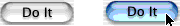
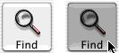
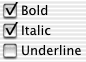
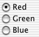

# `Button`的类型

`Button`类型决定`Button`的行为：按下时`Button`如何突出显示以及`Button`是否显示其状态。按钮类型分为三类：

* `Push Button`
* `Sticky Button`
* `单选按钮`和`复选框`

你可以使用`setButtonType:`设置`Button`类型。

## Push Button

这些`Button`不显示状态，因此对于触发操作最有用。鼠标按住`Button`时，它们会更改自己的外观；当鼠标释放`Button`时，它们会变回自己的原始外观。

* 要让[NSButton]()控制按下`Button`的外观，请使用[NSMomentaryPushInButton]()（在`Interface Builder`的`Button Inspector`中称为“`Momentary Push`”）。当鼠标按下`Button`时，该`Button`显示为已被按下。 这是一个`NSMomentaryPushInButton`的示例，该`Button`的边框样式为[NSRoundedBezelStyle]()，不分常规外观和嵌入式外观：

以下是带有[NSThickerSquareBezelStyle]()边框样式的[NSMomentaryPushInButton]()按钮的示例。边框样式[NSRegularSquareBezelStyle]()和[NSThickSquareBezelStyle]()相似。

* 要控制自己按下`Button`的外观，请使用[NSMomentaryChangeButton]()（在`Interface Builder`的`Button Inspector`中称为“`Momentary Change`”）。鼠标按下`Button`时，它将显示替代图像和替代标题。鼠标释放`Button`时，它将显示正常图像和标题。如果你尚未为`Button`设置替代图片或名称，则其外观不会改变。

## Sticky Buttons

这些`Button`显示其状态，并在按下时显示停留。单击一个后，它显示保持按下的状态，直到再次单击它为止。

* 要让[NSButton]()控制按下`Button`的外观，请使用[NSPushOnPushOffButton]()（在`Interface Builder`的`Button Inspector`中称为“`Push On/Push Off`”）。单击一次后，按钮显示已被按下。再次单击后，该`Button`显示回弹。弹回的外观用于关闭状态（[NSOffState]()），按下的外观用于打开状态和混合状态（[NSOnState]()和[NSMixedState]()）。这对于显示App中某些内容的状态的`Button`（例如，显示所选文本是否为粗体的`Button`）很有用。
* 要控制按下`Button`的外观，请使用[NSToggleButton]()（在`Interface Builder`的`Button Inspector`中称为“`Toggle`”）。单击一次后，`Button`将显示其备用图像和标题。再次单击后，该`Button`将显示其正常图像和标题。如果没有备用图片或标题，则`Button`的外观不会改变。正常图像和标题用于关闭状态（[NSOffState]()），备用图像和标题用于打开状态和混合状态（[NSOnState]()和[NSMixedState]()）。这对于在两个动作（例如，“停止”和“开始”）之间切换的`Button`很有用。

如果希望`Button`在所有三种状态下显示不同的外观，则必须子类化[NSButton]()。

## `单选按钮`和`复选框`

这些`Button`显示App中某些内容的状态。它们是[NSToggleButton]()的专用版本，具有系统定义的图像。

* 要在两个选项之间进行选择，请使用[NSSwitchButton]()，它看起来像一个复选框。这种类型的按钮在`Interface Builder`中可以作为单独的调色板项使用。

* 要选择两个以上的选项，请使用[NSRadioButton]()`Matrix`。`Matrix`和`单选按钮`一起工作，以确保一次只打开一个按钮。这种类型的`Button`在`Interface Builder`中可以作为单独的调色板项使用。

更改用于这些`Button`的图像可能会导致不可预测的结果。如果要使`开关`或`单选按钮`具有自定义外观，请自定义`Toggle Button`或子类化[NSButton]()。

只有`复选框`和`单选按钮`可以针对所有三种状态显示不同的图像，其他类型的`Button`则不能。