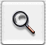

# 使用`Push Button`

`Push Button`执行按钮名称所描述的操作。通常，它是一个圆角矩形，其中包含其名称。例如，此按钮可能会出现在一个`对话框`中，该`对话框`可在文档中查找文本：

在`Interface Builder`中创建按钮最简单。你还可以通过编程方式创建一个`NSButton`实例，该实例的类型为`NSMomentaryPushInButton`，图像位置为`NSNoImage`，边框为`NSRoundedBezelStyle`。

你也可以有一个带图标的`Push Button`，也就是说，该按钮主要由其图标标识，并且几乎没有文字。它是矩形的，像这样：

你可以在`Interface Builder`中或以编程方式创建带图标的`Push Button`。如果使用`Interface Builder`，请从常规`Push Button`开始。如果以编程方式创建它，请创建一个`NSButton`实例，然后将其类型设置为`NSMomentaryPushInButton`，将其图像位置设置为`NSImageOnly`，将其边框类型设置为方形边框类型。最后，将图像设置为所需的图像。

> **注意：** 文本按钮上可能有小图像，而图标按钮上可能有`Label`。重要的问题是什么是最突出的。如果是文字，请将其视为文字按钮。如果是图片，请将其视为图标按钮。

你还可以有一个在两个状态之间切换的`Push Button`，每个状态都有其自己的标题和图像。例如，一个按钮可以在“开始”和“停止”之间切换。你可以使用与`Interface Builder`或以编程方式创建常规`Push Button`相同的方式来创建一个按钮。只需将按钮类型更改为`NSToggleButton`。然后为按钮提供备用标题和图像以及正常标题和图像。该按钮首先显示常规标题和图像，然后在用户单击后显示备用标题和图像。