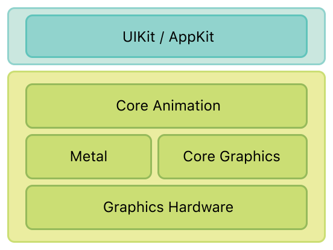

# 关于Core Animation

Core Animation是可在iOS和OS X上使用的图形渲染和动画基础结构，可用于为App的`View`和其他视觉元素制作动画。使用Core Animation，绘制动画的每一帧所需的大部分工作都已为你完成。你所要做的就是配置一些动画参数（例如起点和终点），并告诉Core Animation开始。其余部分将由Core Animation完成，将大部分实际图形工作交给板载图形硬件以加快渲染速度。这种自动图形加速功能可实现高帧率和流畅的动画效果，而不会给CPU造成负担并降低App的运行速度。

如果你正在编写iOS应用，则无论你是否知道Core Animation，你都正在使用它。而且，如果你正在编写OS X应用程序，则可以毫不费力地利用Core Animation。Core Animation位于AppKit和UIKit之下，并紧密集成到Cocoa和Cocoa Touch的视图工作流程中。当然，Core Animation还具有一些界面，这些界面可以扩展应用程序视图所显示的功能，并为你提供对应用程序动画的更精细控制。

## 初识

你可能永远都不需要直接使用Core Animation，但是当你需要使用时，你应该了解Core Animation在应用程序基础结构中扮演的角色。

### Core Animation管理你的应用内容

Core Animation本身不是绘图系统。它是用于在硬件中合成和处理应用程序内容的基础结构。该基础结构的核心是`Layer`对象，你可以使用这些对象来管理和操作内容。`Layer`将你的内容捕获到位图中，图形硬件可以轻松地对其进行操作。在大多数应用程序中，`Layer`用作管理视图内容的一种方式，但是你也可以根据需要创建独立的图层。

> **相关章节：** [Core Animation基础知识]()，[设置`Layer`对象]()

### 修改`Layer`触发动画

使用Core Animation创建的大多数动画都涉及对`Layer`的属性的修改。类似于`View`，`Layer`对象具有边界矩形，屏幕上的位置，不透明度，变换以及许多其他可以修改的面向视觉的属性。对于大多数这些属性，更改属性的值会导致创建隐式动画，从而使`Layer`从旧值动画过渡到新值。如果你想更好地控制生成的动画行为，还可以显式设置这些属性的动画。

> **相关章节：** [`Layer`内容的动画]()，[高级动画技巧]()，[`Layer`样式属性的动画]()，[可设置的动画的属性]()

### 可以将`Layer`组织到层次结构中

`Layer`可以按层次排列图层以创建父子关系。`Layer`的排列以类似于`View`的方式来影响它们管理的视觉内容。附加到`View`的一组`Layer`的层次结构反映了相应的`View`层次结构。你还可以将独立的`Layer`添加到图层层次结构中，以将应用程序的视觉内容扩展到`View`之外。

> **相关章节：** [建立`Layer`层次结构](./BuildingALayerHierarchy.md)

### `Action`可让你更改`Layer`的默认行为

隐式`Layer`动画是使用操作对象实现的，这些对象是实现预定义接口的通用对象。Core Animation使用`Action`对象来实现通常与`Layer`关联的默认动画集合。你可以创建自己的`Action`对象来实现自定义动画，也可以使用它们来实现其他类型的行为。然后，将`Action`对象分配给`Layer`的属性之一。当该属性更改时，Core Animation会检索你的`Action`对象，并告诉它执行其动作。

> **相关章节：** [更改`Layer`的默认行为]()

## 如何使用本文档

本文档适用于需要更好地控制其App动画或希望使用`Layer`来改善其App绘制性能的开发人员。本文档还提供了有关iOS和OS X的`Layer`和`View`之间的集成的信息。iOS和OS X上的`Layer`和`View`之间的集成是不同的，理解这些差异对于能够创建有效的动画很重要。

## 学习的先决条件

你应该已经了解目标平台的视图架构，并且熟悉如何创建基于`View`的动画。如果没有，你应该阅读以下文档之一：

* 对于iOS应用，你应该了解[iOS编程指南]()中介绍的视图架构。
* 对于OS X应用程序，你应该了解[`View`编程指南]()中介绍的视图架构。

## 推荐

有关如何使用Core Animation实现特定类型的动画的示例，请参见[Core Animation Cookbook]()。