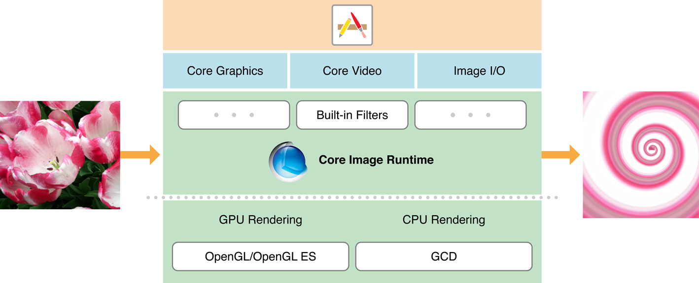

# 关于Core Image

> **重要提示：** 此文档不再更新。有关Apple SDK的最新信息，请访问[文档网站](https://developer.apple.com/documentation)。

Core Image是一种图像处理和分析技术，旨在为静态和视频图像提供近实时的处理。它使用GPU或CPU渲染路径，对Core Graphics，Core Video和Image I/O框架中的图像数据类型进行操作。Core Image通过提供易于使用的应用程序编程接口（API）而隐藏了低级图形处理的繁琐步骤。所以不需要了解OpenGL，OpenGL ES或Metal的详细内容就可以充分利用GPU的强大功能，也无需了解Grand Central Dispatch（GCD）以获得多核处理的优势。 Core Image都会为你把这些细节处理好。

## 初步了解

Core Image框架提供：

* 访问内置图像处理过滤器(Filter)
* 特征检测功能
* 支持自动图像增强
* 将多个过滤器(Filter)链接在一起以创建自定义效果的功能
* 支持创建在GPU上运行的自定义过滤器(Filter)
* 基于反馈的图像处理功能
* 在macOS上，Core Image还提供了一种打包自定义过滤器(Filter)以供其他应用程序使用的方法。

### Core Image是高效的，而且可以非常便捷的用于处理和分析图像

Core Image提供数百种内置过滤器(Filter)。你可以通过为过滤器(Filter)的输入参数提供键值对来设置过滤器(Filter)。一个过滤器(Filter)的输出可以是另一个过滤器(Filter)的输入，从而可以将多个过滤器(Filter)链接在一起以产生惊人的效果。如果创建要多次使用的复合效果，则可以将`CIFilter`子类化以获取效果的“制作过程”。

其中有十几种类别的过滤器(Filter)。有些旨在实现艺术效果，例如风格化和半色调滤镜的类别。其他的，比如说最适合修复图像问题的，例如颜色调整和锐化滤镜。

Core Image可以分析图像的质量，并提供一组具有最佳设置的滤镜，用于调整色调，对比度和色调等内容，以及校正闪光瑕疵（如红眼）。它通过一个方法调用完成这所有的一切。

Core Image可以检测静止图像中的人脸特征，并在视频图像中随时间跟踪它们。了解面部的位置可以帮助你确定放置小插图的位置或应用其他特殊过滤器(Filter)。

> **相关章节**：[处理图像]()，[检测图像中的面部]()，[自动增强图像]()，[子类化`CIFilter`：自定义效果的过程]()

### 查询Core Image以获取过滤器(Filter)及其属性列表

Core Image为其过滤器(Filter)提供了“内置”参考文档。你可以通过查询来找出可用的过滤器。然后，对于每个过滤器，你也可以检索包含其属性的字典，例如其输入参数，默认参数值，最小值和最大值，显示名称等。

> **相关章节**：[过滤器(Filter)查询系统]()

### Core Image可以实现实时视频处理

如果你的应用需要实时处理视频，你可以采取一些措施来优化性能。

> **相关章节**：[获得最佳性能]()

### 使用Image Accumulator支持基于反馈的处理

`CIImageAccumulator`类专为基于反馈的高效图像处理而设计，如果你的应用需要对动态系统进行成像，你可能会觉得这很有用。

> **相关章节**：[使用反馈处理图像]()

### 创建和分发自定义内核(Kernel)和过滤器(Filter)

如果内置过滤器(Filter)即使链接在一起都不适合你的需求，那你也可以考虑创建自定义过滤器(Filter)。你需要了解在像素级别运行的内核程序——因为它们是每个过滤器(Filter)的核心。

在macOS中，你可以将一个或多个自定义过滤器(Filter)打包为图像单元，以便其他应用程序可以加载和使用它们。

> **相关章节**：[编写自定义过滤器之前需要了解的内容]()，[创建自定义过滤器]()，[打包和加载图像单元]()

## 其他内容

Core Image的其他重要文档包括：

* [`Core Image参考集`]()提供了Core Image框架中可用类的详细说明。
* [`Core Image过滤器(Filter)参考`]()描述了Apple提供的内置图像处理过滤器(Filter)，并显示了使用过滤器(Filter)处理前后图像的显示样式。
* [`Core Image内核语言参考`]()介绍了为自定义过滤器(Filter)创建内核例程的语言。