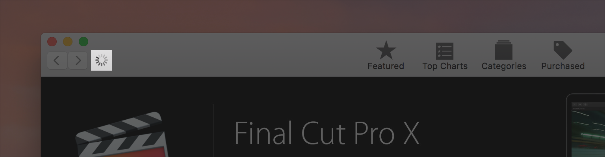

# 载入中

人们想要知道一个App来执行其命令并传达处理需要多长时间。如果你的应用显示空白或静态内容，但未提供反馈，则人们可能会认为您你的应用已冻结。

**提供用户交互的即时确认。** 用户希望每次与你的App互动时都会收到反馈。例如，在整个系统中，单击按钮时的视觉响应，并且指针在屏幕上不同控件和区域上移动时发生的变化。你的App向用户的互动提供反馈的速度越快，它的响应就会越迅速。

**帮助人们确定一个过程将花费多长时间。** 用户不一定总是需要确切地知道任务将花费多长时间，但是对任务进行估算很重要。至少要显示一个活动指示器，它表示正在发生某种事情。理想情况下，应该显示明确的进度指示器和补充描述性文本。例如，Finder将进度条与说明文字结合在一起，以显示复制操作将花费多长时间。

**尽快显示内容。** 如果让人们在等待结果之前看到正在加载，他们可能会认为缺乏内容是一种迟钝。最好在尚无内容的地方显示占位符文本、图形或动画，并在内容加载完成后替换这些元素。只要有可能，就在后台预加载即将出现的内容，例如在播放动画或进行用户交互时加载。

有关其他指导，请参阅[进度指示器]()和[提供用户反馈]()。