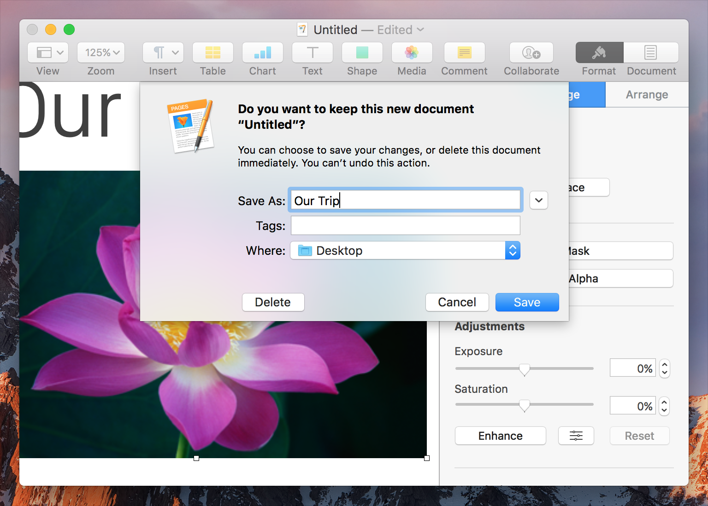
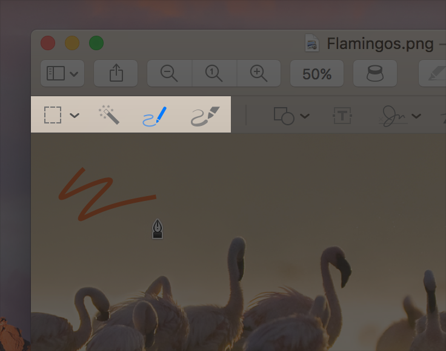
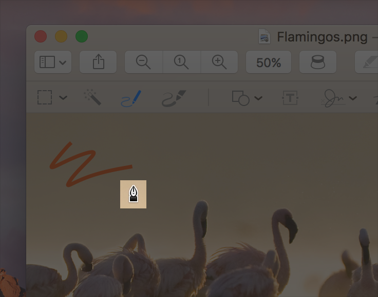

# 模态

模态通过输入无干扰的上下文来建立焦点，这种上下文阻止人们在完成任务，或者关闭消息或视图之前不能做其他事情。`Alert`和`Sheet`是模态视图的示例，用户在想要继续执行任务之前必须将其关闭。在某些模态上下文中，与当前任务无关的功能和交互可能会暂时被禁用。例如，“预览”中的“草图”模式会阻止某些用户操作（例如选择或添加文本），直到用户退出该模式。

**尽量减少使用模态。** 通常，人们喜欢以非线性方式与App进行交互。仅在引起关注的关键——必须完成或放弃任务才能继续使用App、任务需要模态（例如在图形App中使用绘图或选择工具）、或仅在以下情况下才考虑创建模态上下文：保存重要数据。

**选择合理的最小限制模态。** 如果在`文档窗口`中执行某项操作之前必须完成任务，请考虑使用`Sheet`。当用户继续使用App的其他部分时，`Sheet`会禁用文档本身中的交互。有关相关指导，请参见`Sheet`。

**提供安全退出模态上下文的方法。** 人们不应该陷于模态上下文中。例如，当用户单击屏幕上的另一个区域时，模态弹出窗口可以自动关闭。通常，如果用户退出无意义的模态，最好保存用户的工作。离开模态上下文时，用户应始终了解操作导致的结果。

**使模态任务简单、简短且关注重点。** 人们不应该将你的App视为一系列相互分离的任务或过渡，从而导致工作流程混乱。如果模态任务太复杂，那么当用户进入模态上下文时，他们可能会看不见他们在做什么。尽可能为小型独立任务使用模态。

**清楚指出当前模式。** 如果你的App包含不同的模式，人们需要可以一目了然地分辨出所处的模式。例如，在“素描”模式下，“预览”会突出显示“标记工具栏”中该模式的图标，并显示不同的指针样式。

**保留`Alert`，以提供重要且理想的可操作信息。** `Alert`会中断用户的体验，并需要采取措施之后才可以关闭，因此让人们感到干扰是必要的，这一点很重要。如果必须显示`Alert`，请确保清楚地描述问题，解释发生原因的原因，并提供继续操作的选项，包括可能存在的任何解决方法。有关其他指导，请参阅[`Alert`]()。

**遵守通知的偏好设置。** 在系统偏好设置中，人们指定他们希望如何从你的App接收通知。遵守这些偏好设置，这样用户就不会试图完全关闭你的App。

**不要在弹出式窗口上方显示模态视图。** 除可能的`Alert`外，`弹出式窗口`中不应出现任何内容。在极少数情况下，当你在`弹出式窗口`中执行操作后需要提供模态视图时，请在显示模态视图之前关闭`弹出式窗口`。
