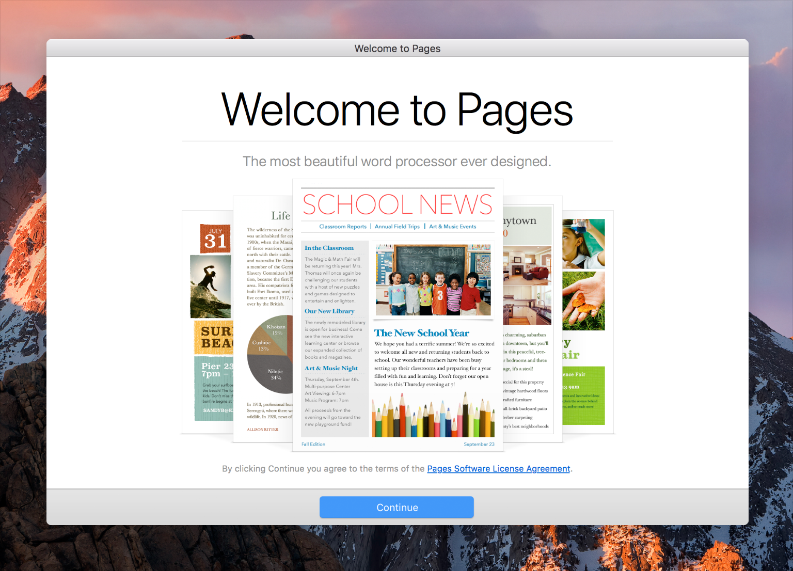

# Onboarding

启动时间是你吸引新用户并与再次访问的用户重新建立联系的第一个机会。应该设计一个快速、有趣且具有指导功能的启动体验。

**避免开始就询问设置信息。** 人们期望App能够直接正常的运行。你应该为占多数的一般用户设计你的App，希望使用不同配置的用户将调整`偏好设置`以满足他们的需求。从系统和默认设置中获取设置信息，或通过iCloud之类的同步服务获取。如果你必须先询问设置信息，请等到实际需要时提示一次设置，并告知用户以后可以对你的App偏好进行调整。

**建立适用于大多数人的默认配置。** 如果你能够很好地衡量受众的需求，则几乎不需要调整默认设置。

**避免启动屏幕和说明。** 不要让人们开始使用你的App就变得很困难。而是让人们直接进入。如果你的应用需要教程或介绍，请提供一种跳过它们的方法，并且不向之后再次使用的用户显示。

**请提前考虑到用户需要的帮助。** 主动寻找人们可能陷入困境的时刻。例如，游戏在暂停或角色前进时可以随机显示有用的提示。如果用户第一次错过某些内容，可以重新访问教程。

**紧跟教程中的要点。** 可以为初学者提供指导，但是指导并不能替代出色的App设计。首先，使你的App看起来更直观。如果需要太多指导，请重新设计App。

**使学习变得有趣且容易发现。** 边做边学比阅读一系列说明更加有趣和有效。建议在上下文中使用动画和互动性逐步进行指导，避免显示为交互式的屏幕截图。

**提供综合帮助。** 将帮助标签添加到App的控件中，并考虑通过帮助​​查看器提供面向任务的文档。有关指导，请参阅[帮助]()。

**自动保存用户的工作。** 人们期望自己的工作能够不断自动保存，而无需手动干预。如果你的应用程序基于文档，请启用自动保存。请参阅[自动保存]()。

**始终准备停止并重新启动。** 大多数人不会区分关闭App的主窗口和退出App的区别。如果你的App只有一个`窗口`，则最好在用户关闭`窗口`时自动退出。