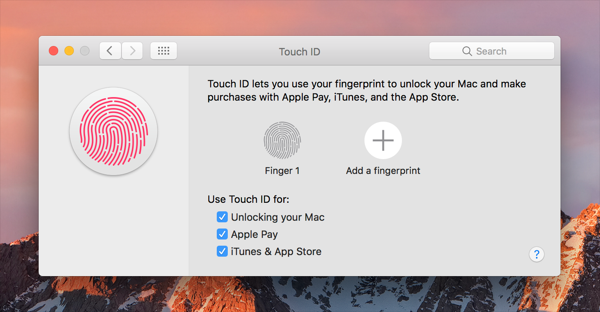

# 安全

人们赞赏macOS的安全性，并期望他们的App同样安全。利用系统提供的安全技术时，你可以在本地安全地存储信息，授权用户进行特定操作以及在网络上传输信息。

**避免仅依靠密码进行身份验证。** 充分利用Touch ID等其他技术，该技术可让用户使用指纹进行身份验证。有关开发人员的指导，请参阅[LocalAuthentication]()。

**将敏感信息存储在钥匙串中。** 在处理某人的私有信息时，密钥链提供了一种安全的、可预测的用户体验。有关开发人员的指导，请参阅[钥匙串服务]()。

**切勿将密码或其他安全内容存储在纯文本文件中。** 即使使用文件权限限制访问，敏感信息在加密的钥匙串中更加安全。

**明智地做出假设。** 例如，不要假设只有一个用户登录。由于快速的用户切换，同一系统上可能有多个用户处于活动状态。

**避免发明自定义身份验证方案。** 如果你的App需要身份验证，请使用系统提供的授权API。有关相关指导，请参阅[身份验证]()。

**将需要特权访问的代码分解到一个单独的进程中。** 分解可将安全代码与非安全代码隔离开来，并使其更容易验证是否发生了有害的恶意操作（无论是否有意）。

**警惕已加载的特权代码。** 特别是，避免加载特权代码插件，这些插件采用其父进程的特权。避免从加载的或特权的代码中调用潜在的危险函数，例如*system*或*popen*。

有关开发人员的指导，请参阅[安全性]()。

## 确保App完整性

用户的“安全性和隐私”偏好设置控制下载的App的使用。从Mac App Store下载的App始终被允许使用。用户可以选择打开并使用由已知开发人员创建的App。

**从Mac App Store出售你的App。** 用户知道商店中的每个App都已经过Apple审查，并且未被篡改。

**使用有效的开发者ID对你的App进行签名。** 如果你选择在商店外分发App，则使用开发人员ID签名App，将你标识为Apple开发人员，并确认你的App可以安全使用。有关开发人员的指导，请参见[Xcode帮助]()。

**通过App沙箱保护用户数据。** 沙箱可让你的App访问系统资源和用户数据，同时保护其免受恶意软件的侵害。提交到Mac App Store的所有App都需要沙箱。有关开发人员的指导，请参阅[App沙箱设计指南]()。