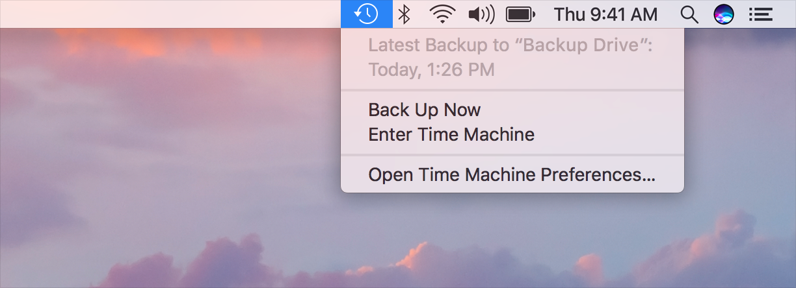

# 状态菜单

`状态菜单`通过图标显示App特定的功能，该图标在你的App运行时会出现在`菜单栏`中，即使它不是最前面的App也是如此。`状态菜单`位于`菜单栏`中`App菜单`的另一侧。系统会隐藏`状态菜单`，以便为`App菜单`腾出空间。同样，如果有太多的`状态菜单`，系统可能会隐藏一些`状态菜单`以避免挤到`App菜单`。

**使用`Template Image`来显示`状态菜单`。**`Template Image`会丢弃颜色信息，并使用遮罩产生你在屏幕上看到的外观。`Template Image`会自动适应用户的外观设置，因此它们在深色和浅色`菜单栏`上以及选中状态的`状态菜单`上都看起来很不错。

**当用户单击`状态菜单`时，显示一个菜单（而不是弹出窗口）。**除非你要显示的App功能对于菜单而言过于复杂，否则应避免在`弹出窗口`中显示`窗口`。请参阅[弹出窗口](./Popovers.md)。

**让使用者决定是否启用`状态菜单`。**由用户，而不是由App，来选择何时将`状态菜单`添加到`菜单栏`。通常，这是通过在App的`偏好设置`窗口中更改设置来完成的。但是，为确保可发现性，请考虑在设置过程中让人们选择启用`状态菜单`。

**不要依赖`状态菜单`功能。**系统会定期隐藏和显示`状态菜单`，并且你无法确定用户选择显示的`状态菜单`，以及无法确定`状态菜单`在`菜单栏`中的位置。

**也可以考虑以其他方式展示App的特定功能。**例如，你可以提供Dock菜单，当用户按住Control并单击App在Dock上的图标时，该菜单就会出现。用户可以隐藏或选择不使用你的App的`状态菜单`，但是当你的应用程序运行时，Dock菜单一直都是可用的。请参阅[Dock菜单]()。