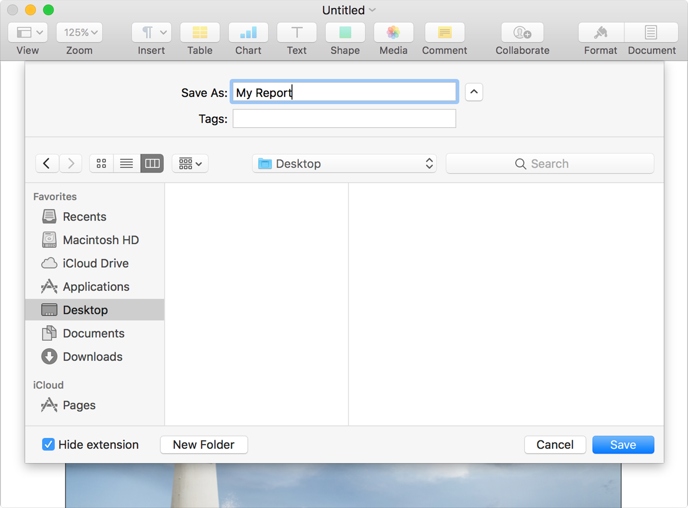
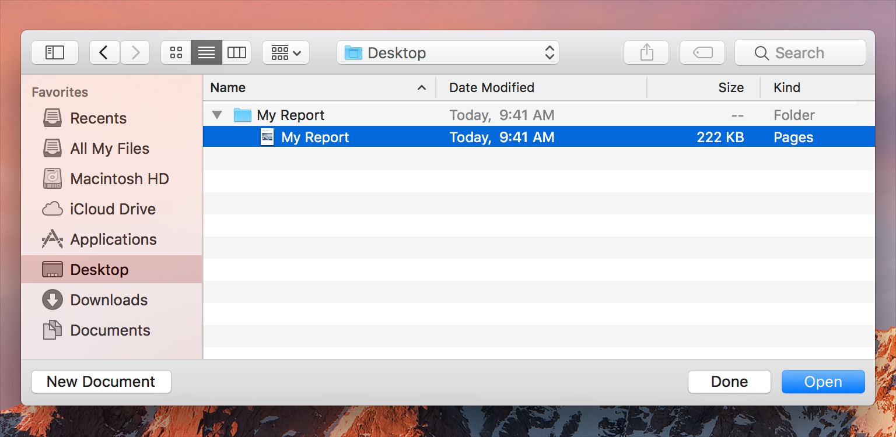
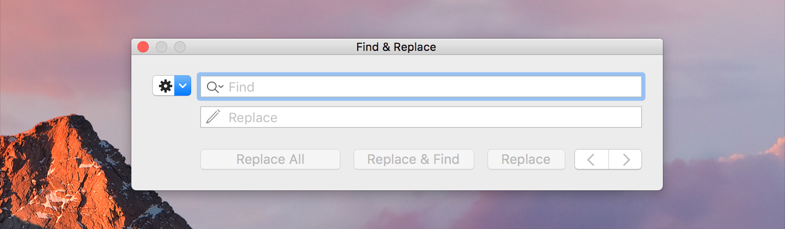
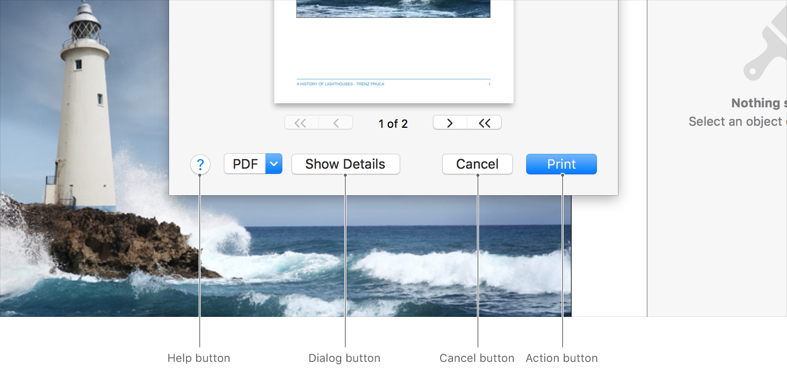

# 对话框

`对话框`是一种可引起用户响应的窗口。许多`对话框`（例如`打印对话框`）让人们一次提供多个响应。`对话框`以三种方式显示：*文档模式*，*App模式*和*无模式*。

> **提示**
> 
> `Alert`是一种特殊类型的`对话框`，可提供有关错误状况的重要信息或向用户警告潜在的危险情况或后果。有关指导，请参阅[`Alert`](./Alerts.md)。

## 文档模式对话框

`文档模式对话框`以`Sheet`的形式附加到文档（请参见[`Sheet`](./Sheets.md)），并阻止用户在文档中执行任何操作，直到关闭`对话框`。用户仍然可以切换到其他文档和App。`保存对话框`是`文档模式对话框`的示例。请参阅[`保存对话框`](../UserInteraction/FileHandling.md#保存对话框)。

## App模式对话框

`App模式对话框`可阻止用户在该`对话框`关闭之前在App中执行任何操作。用户仍然可以切换到其他App。`打开对话框`是`App模式对话框`的一个示例。请参阅[`打开对话框`](../UserInteraction/FileHandling.md#打开对话框)。

## 无模式对话框

`无模式对话框`通常称为`面板`。用户可以不间断地继续与文档和App进行交互。标准的`查找对话框`是`无模式对话框`的示例。请参阅[`查找对话框`](../UserInteraction/FileHandling.md#查找对话框)和[`面板`](./Panels.md)。

## 数据输入

`对话框`是小型的瞬态窗口，不需要深入的用户交互，因此确保数据输入效率非常重要。

**尽可能提供`控件`和字段的默认值。** 与从头开始输入相比，用户更容易验证信息。

**将初始焦点设置为接受用户输入的第一个位置。** 这样一来，用户就可以立即开始输入数据，而无需单击诸如文本字段或列表之类的特定项目。

**使静态文本为可选。** 例如，用户应该能够复制有用的信息，例如错误消息，序列号或IP地址，以粘贴到其他位置。

**在数据输入期间检查错误。** 在用户尝试关闭`对话框`时，无需等待并显示警报，而应在数据输入期间检查错误，以便用户可以在上下文中解决问题。最好在输入后立即检查值。避免在每次击键后进行验证，因为过于频繁的验证会减慢你的App的速度并令人讨厌。

**尽可能将无效输入的可能性降到最低。** 例如，使用`弹出按钮`提供选择而不是要求用户输入数据，并使用日期选择器和数字格式器来确保正确输入日期和数字。有关相关指导，请参阅[`弹出按钮`]()，[日期选择器]()和[文本字段>数据输入]()。

**考虑包括一个`应用按钮`，该按钮使用户可以在提交更改之前预览更改。** 在`无模式对话框`中，`应用按钮`对于可以快速应用、预览和撤消的更改很有意义。`保存对话框`以及其他使用户无法轻易预览的更改`对话框`不应包含`应用按钮`。

## 布局

**使用`展开控件`提供仅偶尔需要的信息或功能。** `展开控件`隐藏信息或功能（如高级选项），并且仅在用户单击`控件`时才显示信息或功能。有关指导，请参阅[`展开控件`]()。

**调整`对话框`大小时，请确保正确缩放界面元素。** 当`对话框`允许调整大小时，可以随`对话框`的缩，元素应相应地进行缩放。通常，`盒子`，`选项卡视图`和`表格`之类的`视图`应展开以填充`对话框`。在`表格`中，应扩展现有`列`，并根据需要显示新的`列`和`行`。其他通常不会调整大小的元素（例如`按钮`，`复选框`和`分段控件`）应保持相同大小，并固定在`对话框`的侧面（或中心）。

**按预期位置放置按钮。** `对话框`右下方的任何按钮都应是关闭该`对话框`。用于启动`对话框`主要操作的`操作按钮`应位于最右边。`取消按钮`应位于`操作按钮`的紧靠左侧。如果存在第三个`销毁按钮`，则该`按钮`应位于`取消按钮`的左侧。`帮助按钮`应位于最左侧。影响`对话框`本身内容的`按钮`（例如用于扩展`对话框`以显示其他详细信息的`按钮`）应位于`帮助按钮`的右侧，如果不存在`帮助按钮`，则应位于最左侧。

**将`破坏性按钮`与`非破坏性按钮`分开。** `破坏性按钮`（例如`不保存`）应与`安全按钮`（例如`保存`和`取消`）相距足够远，以便用户必须做出一定的努力才能单击该`按钮`。如果可能，请至少留出24个点来进行分离。

## 对话框销毁

**仅在用户最可能采取的措施无害时才提供`默认按钮`。** 用户有时仅按`Return`键即可关闭`对话框`，而无需阅读其内容，因此，`默认按钮`启动无害操作至关重要。如果没有`默认按钮`，则按`Return`键将无效。用户应该必须明确地单击一个`按钮`才能关闭该`对话框`。或者，当`对话框`可能导致破坏性行为时，可以将`取消`设置为`默认按钮`。

**仅当`对话框`上的文本字段尚未使用`Return`键时，才提供默认按钮。** 一个键具有两种行为会造成混乱，并使接口的可预测性降低。用户可能多次按回车键，而无意间激活了`默认按钮`。

**包括一个`取消按钮`，用于响应标准的取消键盘快捷键。** `取消按钮`提供了一种清晰、安全的方法来销毁`对话框`，并使计算机返回到出现`对话框`之前的状态。确保键盘快捷键`Command-period`和`Esc(Escape)`键已映射到`取消按钮`。

**确保`取消按钮`撤消所有已应用的更改。** `取消按钮`绝不能将 用户通过单击`应用按钮`预览的更改 静默提交。

**按预期使用`应用`、`确定`和`取消`按钮。** 点击`应用`会更改预览，但不会关闭`对话框`。单击`确定`确认接受任何更改的意图并退出该`对话框`。单击`取消`将放弃所有已应用的更改并关闭该`对话框`。

**确保`对话框`动作迅速发生。** 通常，从`对话框`启动操作后，用户应看到接近即时的结果。对于需要花费几秒钟才能完成的操作，请显示进度信息，以便用户知道该操作已启动，将花费多长时间以及何时完成。有关相关指导，请参阅[进度指示器]()。