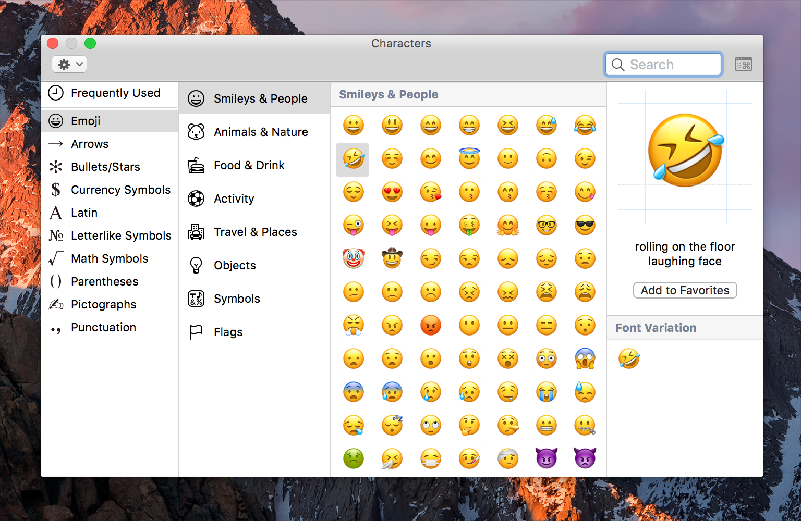
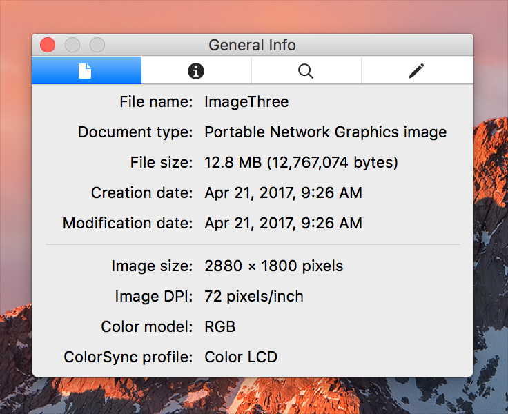
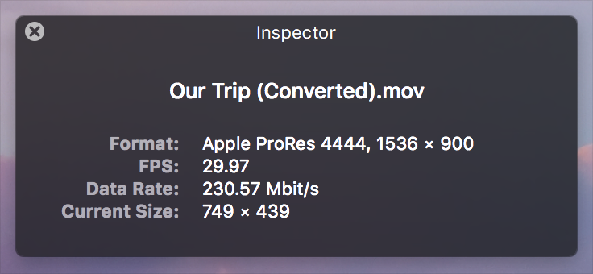

# 面板

`面板`是一个辅助`窗口`，其中包含与活动文档或选择有关的`控件`、选项或信息。`面板`看起来不如`主窗口`突出，并且可以像`普通窗口`一样工作，也可以配置为浮动在其他打开的`窗口`（甚至是`模态窗口`）上方。当用户体验需要时，`面板`还可以采用深色，半透明（HUD风格）的外观。

**使用`面板`可以快速访问重要的`控件`或与内容相关的信息。** 例如，你可以使用`面板`来显示影响活动文档窗口的`控件`或设置。

**考虑替代`面板`。** 由于面板占用了屏幕空间而不是内容，因此许多应用程序使用[`弹出式窗口`]()，[`侧边栏`]()，[`分隔视图`]()和[`工具栏`]()来提供辅助信息和工具，而不会引起干扰。例如，`Keynote 讲演`，`Numbers 表格`和`Pages 文稿`都包括格式化窗格，这些窗格作为`侧边栏`（可以快速隐藏和显示）附加到文档窗口。

**根据目的为`面板`命名。** 使用标题样式大写的名词或名词短语。一些常见的`面板`标题是*字体*、*颜色*和*Inspector*。

**适当显示和隐藏`面板`。** 激活文档后，将App中所有打开的`面板`置于最前面，而不管显示`面板`时哪个文档处于活动状态。当某个App处于非活动状态时，其所有`面板`均应隐藏。

**在`Window`菜单底部的文档列表中不要包括`面板`。** 可以在`Window`菜单中包含用于显示或隐藏`面板`的命令，但不要将`面板`列为文档。

**确保所有`面板`都包含标题栏。** 即使`面板`不需要标题，也可以为其指定标题栏，以便用户拖动`面板`以将其重新放置在屏幕上。

**通常，禁用`面板`上的“最小化”按钮。** `面板`不需要最小化，因为它仅在需要时显示，在App不活动时消失。但是，应该启用“关闭”按钮（在某些情况下为“缩放”按钮）。

**在界面和用户文档中按标题引用`面板`。** 在菜单中，仅包含`面板`的标题。例如，*显示字体*，*显示颜色*，*显示Inspector*。在文档中，你可能需要为某些`窗口`提供其他上下文。例如，*字体窗口*，*颜色窗口*。其他窗口（例如*Inspector*）可能会提供足够的信息以独立运行。

**保持`Inspector面板`为最新。** `Inspector`是一种`面板`类型，它使人们可以查看并有时编辑当前所选内容的属性。`Inspector面板`中显示的信息应始终与所选内容的当前状态匹配。如果选择的属性发生更改或用户进行了其他选择，`Inspector`应进行相应的更新。

**除了`Inspector`之外，还考虑提供`信息窗口`。** `信息窗口`是一个`标准窗口`，它显示打开该`窗口`时捕获的内容属性（有时是多个项目）。即使选择更改，这些属性也会继续显示。与`Inspector`不同，`信息窗口`显示在`Window`菜单的文档列表中，不会浮在其他`窗口`上方，可以最小化，并且在App变为非活动状态时仍然可见。

有关开发人员的指导，请参阅[NSPanel]()。

## HUD样式的面板

`HUD样式的面板`（简称为HUD）具有与`普通面板`相同的功能，但其外观更暗且半透明。HUD旨在补充专注于高视觉内容或提供沉浸式体验（例如全屏幻灯片放映）的App。例如，`QuickTime Player`使用HUD来显示`Inspector`信息，而不会妨碍用户的内容。

**首选`标准面板`。** 如果HUD没有逻辑上的原因，人们可能会分心或困惑。通常，HUD仅应在以下情况下使用：

* 在面向媒体的App中使用，该App专注于电影，照片或幻灯片。
* 在具有深色界面的沉浸式App中。
* 当一个标准的`面板`遮盖了基本内容时。
* 当使用`面板`进行快速调整然后关闭时。

**结合使用`标准面板`和HUD。** 如果你的App仅在特定时间或仅在某些模式下专注于视觉内容，请使用最适合当前任务和环境的`面板`类型。

**当你的App切换模式时，请勿切换`面板`类型。** 例如，如果你在沉浸式模式下使用HUD，则当你将App切换为非沉浸式模式时，请勿将其转换为`标准面板`。

**在HUD中使用简单的调整`控件`。** 避免使用需要输入文本或选择项目的`控件`，因为这些操作会迫使人们将注意力从内容转移到`面板`上。相反，请使用`滑块`和`步进器`之类的控件，因为它们易于使用而无需关注它们。

**在HUD中谨慎使用颜色。** HUD深色外观中包含的太多颜色可能会分散注意力并减轻`面板`的效果。通常，只需要少量的高对比度颜色即可增强HUD中的信息。

**尽可能减小HUD。** HUD设计为实用性很强，因此让它们过大的显示会破坏其主要目的。HUD不要遮挡它想要调整的内容，并确保它不会与内容争夺用户的注意。

有关开发人员的指导，请参见[NSWindowStyleMaskHUDWindow]()。