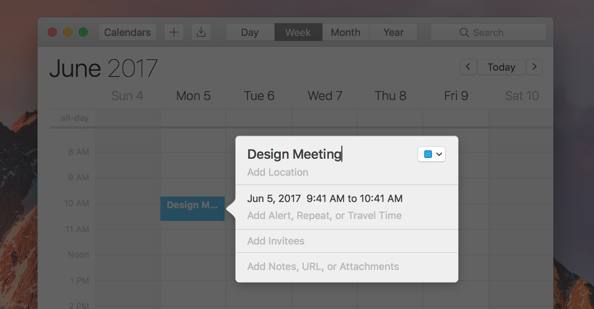
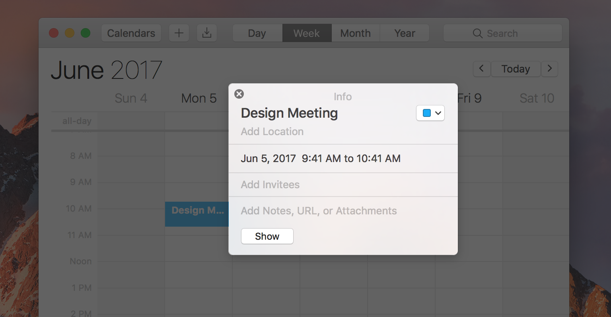

# 弹出窗口

`弹出窗口`是单击`控件`或`视图`时显示在屏幕的其他内容上方的`视图`。例如，当你在日历中双击一个事件时，会在一个`弹出窗口`中显示信息。通常，`弹出窗口`包括指向其出现位置的箭头。`弹出窗口`还支持[Vibrancy](../VisualDesign/Translucency)。

`弹出窗口`可以响应于用户交互（*瞬态*行为），响应用户与`弹出窗口`呈现的`视图`或`元素`的交互（*半瞬态*行为）并且以App定义的方式关闭。`弹出窗口`也可以被拆卸。当用户拖动`弹出窗口`时，可将`弹出窗口`分离成为一个单独的`窗口`，从而在用户与其他内容进行交互时使其在屏幕上保持可见。

**使用`弹出窗口`展示少量信息或功能。** 由于`弹出窗口`在用户与其交互后消失，因此将弹出窗口中的功能限制为一些相关任务。例如，日历的事件弹出框使人们可以轻松更改事件的日期或时间，或将其移动到另一个日历。用户进行更改后，`弹出窗口`消失，使他们能够继续查看日历中的事件。

**考虑使用`弹出窗口`而不是侧边栏和面板之类的临时视图。** `弹出窗口`可以帮助你简化界面，为内容留出更多空间。

**根据`弹出窗口`的功能启用对应的关闭行为。** 当不再需要`弹出窗口`时，它将自动关闭。如果`弹出窗口`仅显示一组选项，请考虑在用户做出选择后立即将其关闭，这与菜单的行为类似。当可以进行多个选择时，`弹出窗口`应保持打开状态，直到用户明确将其关闭或在其边界之外单击。

**提供“关闭”按钮仅用于确认或指导。** 关闭按钮（例如“取消”或“完成”）仅在其明确需要时才提供，例如用于保存或不保存更改的退出。

**自动关闭`弹出窗口`时，请务必保存工作。** 单击屏幕上的另一个区域通常很容易无意间关闭`弹出窗口`。仅当有人单击明确的“取消”按钮时，才不保存工作。

**小心在屏幕上放置`弹出窗口`。** `弹出窗口`的箭头应直接指向显示它的元素。点击后显示`弹出窗口`的元素也不应该被它显示的`弹出窗口`所覆盖。

**考虑让人们分离`弹出窗口`。** 如果希望在`弹出窗口`保持可见的情况下查看其他信息，则用户可能希望能够将`弹出窗口`转换为面板。

**对分离的`弹出窗口`进行最小的外观更改。** 该面板应类似于原始的`弹出窗口`，因此用户不会失去上下文。

**一次在屏幕上显示一个`弹出窗口`。** 显示用户未明确分离的多个`弹出窗口`会使界面混乱，并引起混淆。切勿显示一个`弹出窗口`层叠在另一个`弹出窗口`之上或之下。如果需要显示新的`弹出窗口`，请先关闭已经打开的`弹出窗口`，然后再打开另一个。

**不要在`弹出窗口`上显示其他`视图`。** 除`Alert`外，`弹出窗口`层级之上不应显示任何内容。

**避免使`弹出窗口`太大。** `弹出窗口`不应占据整个屏幕。使它仅大到足以显示其内容并指向其来源。

**通常，保留标准的`弹出窗口`外观。** 默认情况下，`弹出窗口`外观为浅色，当然也可以使用深色外观，但通常深色外观的`弹出窗口`适用于沉浸式，以媒体资源为中心的App。

**确保自定义`弹出窗口`仍然和标准`弹出窗口`长得很像。** 尽管你可以自定义`弹出窗口`的许多视觉外观，但要避免创建人们可能不会识别为`弹出窗口`的设计。`弹出窗口`只包含标准控件和视图时，它们往往具有更好的效果。

**更改`弹出窗口`的大小时，提供平滑的过渡。** 一些`弹出窗口`提供相同信息的简明视图和扩展视图。例如，日历的事件`弹出窗口`在最初显示时是折叠的。当编辑某些属性时，它会展开以显示其他选项。对大小变化进行动画处理，以避免给人以新的`弹出窗口`代替旧的`弹出窗口`的印象。

**不要将`弹出窗口`用作提醒。** `弹出窗口`和`Alert`是非常不同的界面元素。人们选择看到一个`弹出窗口`时，他们不应该看到一个`Alert`。如果交替使用`弹出窗口`和`Alert`，则会模糊它们之间的区别并引起混乱。如果你使用`弹出窗口`警告用户严重问题或帮助他们避免迫在眉睫的意外数据丢失，则可能会导致用户忽略`弹出窗口`而不阅读内容，并在出现负面结果时指责你的App。如果你确实需要警告用户（这种情况很少发生），请使用`Alert`。请参阅[Alert]()。

**避免在用户文档中使用“弹出窗口”一词。** 而是，请参考特定的任务或选择。例如，你可以写“选择'显示'按钮”来代替“选择弹出窗口底部的'显示'按钮”。也不要将`弹出窗口`称为`对话框`或`窗口`。

有关开发人员的指导，请参阅[NSPopover](../../AppFrameworks/AppKit/UserInterface/WindowsPanelsAndScreens/Popovers/NSPopover/)。
