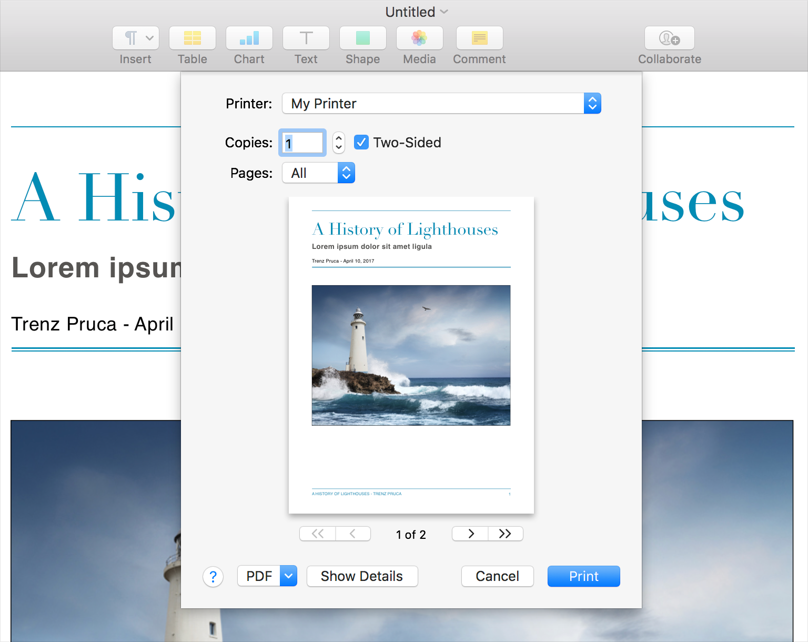

# Sheet

`Sheet`是附加到特定`窗口`（通常是文档）的`模态对话框`，并在`Sheet窗口`被销毁之前阻止与`窗口`的进一步交互。当显示时，`Sheet`会呈现动画效果，就像从主体区域上方的`窗口`框架中露出来一样。由于`Sheet`已附加到特定`窗口`，因此用户始终可以将`Sheet`与其`父窗口`相关联。如果是带标签的`窗口`，则`Sheet`属于活动的那个标签，并且用户必须先关闭`Sheet`才能切换到其他标签。

`Sheet`是在进行特定于文档的操作（例如附加文件，导出，保存和打印）之前请求用户输入的好方法。`Sheet`还可以用于在下一步之前向用户提供信息，例如需要接受的许可协议。

**仅当`窗口`具有框架时才使用`Sheet`。** `Sheet`应始终从主体内容的窗口框架上方露出。

**在其他`窗口`上方打开`Sheet`。** 通常，打开`Sheet`时，窗户及其附属的`Sheet`应位于最前面。一旦显示了`Sheet`，用户应该能够单击另一个`窗口`将其放回到前面。请注意，当文档位于最前面时，任何与非模式相关的`文档面板`也应该位于最前面。

**尽可能避免一次在`窗口`上显示多个`Sheet`。** 如果`Sheet`中的用户操作导致显示另一`Sheet`，请在显示新`Sheet`之前考虑关闭前一个`Sheet`。如有必要，你可以在关闭第二个`Sheet`后再次显示第一个`Sheet`。

**在多个`窗口`中打开同一文档时，请使用`App模态对话框`而不是`Sheet`。** 一些应App使用户可以在多个`窗口`中打开文档，以便他们可以一次查看和编辑文档的不同部分。在这种情况下，不清楚在一个`Sheet`上进行的更改会影响所有打开的文档窗口。

**如果用户需要查看`窗口`或与`窗口`进行交互以销毁`对话框`，请使用`面板`而不是`Sheet`。** 如果`对话框`要求用户必须从`窗口`获取信息，则该`对话框`不应为`Sheet`。`面板`是更好的选择，因为它是无模式的，并且允许用户继续浏览文档以收集信息。请参阅[`面板`](./Panels.md)。

**如果用户需要反复提供输入并观察结果，请使用`面板`而不是`Sheet`。** 例如，“查找和替换”`面板`可能会让用户单独发起替换，因此可以观察每个结果的正确性。

有关相关指导，请参见[`对话框`](./Dialogs.md)和[窗口刨析](./WindowAnatomy.md)。有关开发人员的指导，请参见[NSWindow]()的[beginSheet]()方法。