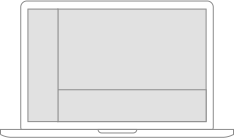
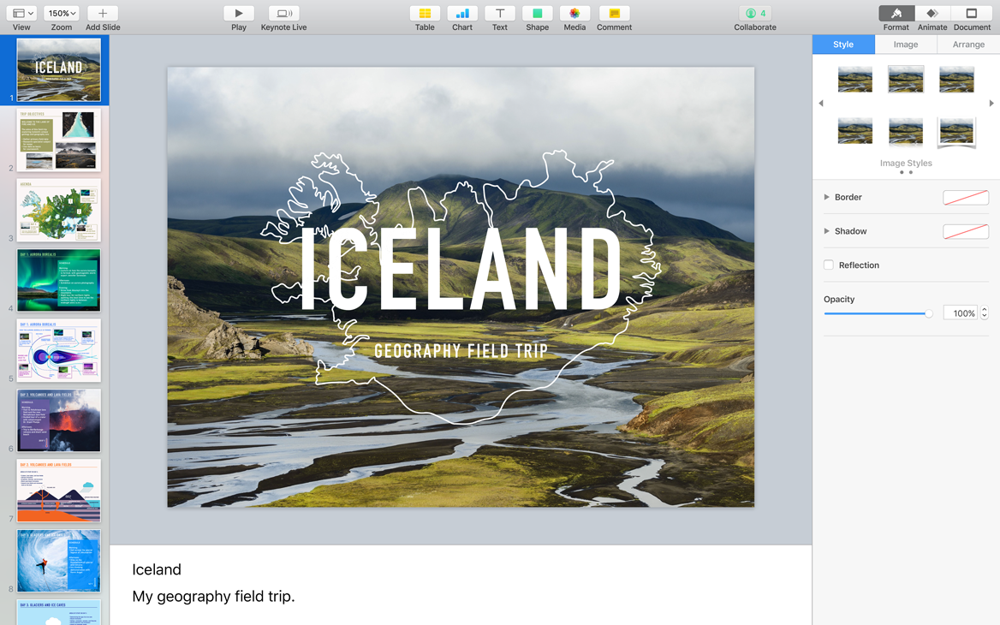
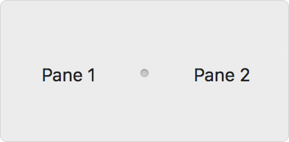
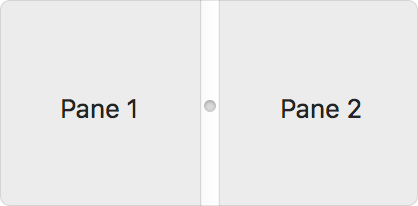

# 分隔视图

分隔视图管理两个或更多内容窗格的呈现。每个窗格可以包含各种元素，包括按钮，表格，列视图，文本字段，甚至其他分隔视图。例如，在`Keynote 讲演`中，分隔视图构成了演示文稿文档的导航器，编辑器，检查器和演示者注释区域。

分隔视图的窗格可以水平或垂直排列，并由分隔符分隔，分隔符通常可以拖动以调整窗格的大小。每个窗格可以具有最小和最大大小，这会影响可以调整的大小。许多App可让用户根据要求隐藏特定的窗格。例如，在`Keynote 讲演`中，用户可以隐藏导航器和演示者注释区域，以便专注于编辑幻灯片内容。

|   |   |   |
|:-:|:-:|:-:|
|  |  |  |

**合理的允许隐藏窗格。** 例如，如果你的App包含编辑器区域，请考虑让用户隐藏其他窗格，以减少干扰或为编辑留出更多空间。

**提供多种访问被隐藏的窗格的方法。** 在可能被隐藏的窗格的布局上，在工具栏添加按钮或菜单项提供键盘快捷键，以再次显示窗格。

**为窗格设置适当的最小尺寸和最大尺寸。** 窗格过小时，分隔线可能会丢失。为防止这种情况，请为你的窗格提供最小和最大尺寸，以便分隔符始终保持可见。

有关开发人员的指导，请参见[NSSplitViewController]()和[NSSplitView]()。

## 分隔器

分隔视图可以采用以下分隔符样式之一。你还可以更改分隔线的颜色，更改分隔线的厚度或设计完全自定义的分隔线。

|  |  |  |
|:-:|:-:|:-:|
|  |  |  |

用户可以单击分隔线的任何部分并拖动以调整大小。对于较薄的分隔线，可点击区域在分隔线的每一侧还包括两个点。

**更喜欢薄分隔线样式。** 用户习惯了薄型分隔器的外观。当你需要指示窗格之间更强烈的视觉区别时，请考虑使用厚分隔板或窗格分隔器样式。例如，当拆分视图的每一侧都包含一个表时，更大的分隔符可以帮助人们区分两个表。