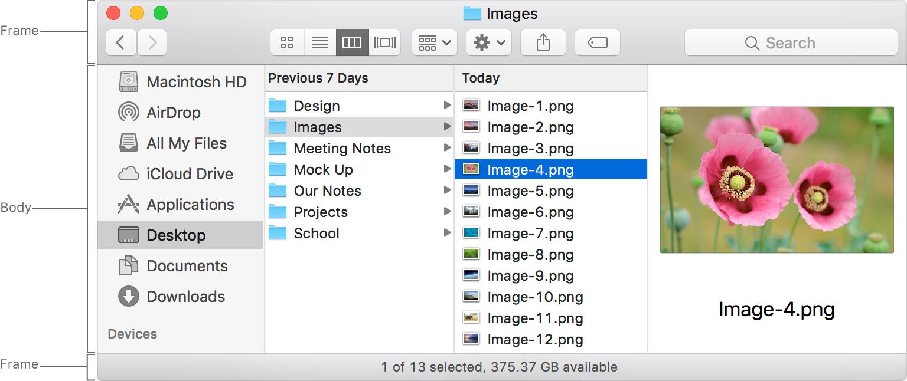

# 窗口刨析

`窗口`由`框架`区域和`主体`区域组成，使用户可以查看App中的内容并与之交互。一个`窗口`可以与其他`窗口`并排出现在屏幕上，或者可以填满整个屏幕（请参阅[全屏模式](../AppArchitecture/FullScreenMode.md)）。在非全屏`窗口`中，用户可以单击并拖动框架以将`窗口`重新放置在屏幕上。如果`窗口`支持调整大小，则用户还可以单击并拖动`窗口`的边缘以调整其大小。

有关开发人员的指导，请参见[NSWindow]()。

## `窗口`类型

macOS中有多种`窗口`。

| `窗口`类型 | 说明 | 例子 |
|:---------|:-----|:----|
| 文档窗口 | 呈现数据供用户查看，编辑和打印。 | `文本编辑`应用 `Keynote 演讲`应用 PDF文件的预览窗口 Safari显示网页的窗口 |
| App窗口 | 呈现与文档无关的内容和功能。App中的主窗口被视为主应用程序窗口。 | `日历`应用 `通讯录`应用 Finder窗口 |
| 面板 | 浮动在其他窗口上方，以提供信息，配置选项或用于与另一个窗口中的内容进行交互的工具。有关指导，请参阅[面板]()。 | 标准色彩面板 标准字体面板 `预览`应用中的文档检查器 |
| 对话框 | 出现是对用户操作的响应，需要用户操作（例如单击按钮）才能取消或继续执行操作。请参阅[对话框]()。 | 打开文件对话框 保存文件对话框 打印对话框 |
| Alert | 一种对话框，以模态形式出现，以提供有关错误状况的重要信息或警告用户有关潜在危险情况或后果的信息。有关指导，请参阅[Alerts](./Alerts.md)。 | 清空垃圾桶时的警告 以及提醒您注意服务器连接错误的警报 |

> **提示**
> 
> `弹出式窗口`是一个过渡视图，可以非介入地提供与当前上下文有关的信息或编辑功能。尽管`弹出式窗口`在外观和功能上类似于`面板`，但它不被视为`窗口`。有关指导，请参阅[弹出式窗口](./Popovers.md)。

## 窗口`框架`

`框架`是`窗口`的一部分，围绕`主体`内容。`窗口``框架`可以包括`标题栏`，`工具栏`，`选项卡栏`和（在极少数情况下）`底部栏`。

### `标题栏`

`标题栏`位于`窗口`的顶部，并包含用于关闭，最小化和缩放（或扩展到全屏模式）`窗口`的选项。这些选项通常是可见的，但可以作为一个组进行隐藏（例如在`QuickTime Player`中播放电影时）或单独禁用（例如在无法最小化全屏App时）。大多数`标题栏`会显示文件名，但并非总是如此。例如，`Alert`的`标题栏`为空。文档窗口的`标题栏`可能还会显示一个图标，并让用户单击标题以更改文档的文件名，标签和位置。`标题栏`应该是可见的，但可以在游戏等沉浸式应用程序中隐藏。

**提供标题，除非有足够的上下文说明而没有必要。** 对于`文档窗口`，标题是文档名称或“无标题”（对于新文档）。对于`App窗口`，标题是App的名称。对于其他`窗口`，标题可能是特定类型的功能，例如*Inspector*。

**将文件名用作窗口标题时，请使用显示名称。** 显示名称反映了用户对显示或隐藏文件扩展名的偏好，并且还可以包含本地化的文本。

不要在标题栏中显示文件或文件夹路径。路径通常太长而无法在标题栏中插入而不会被剪切，因此一眼就很难解析。请在标题栏中显示文件名。如果要公开完整的路径，请以其他方式公开，例如通过检查器窗格。

使用数字后缀来区分重复的标题。标题的第一个实例不应带有数字后缀。如果还有其他具有相同标题的窗口，则这些窗口应包含以2开头的数字后缀。例如，无标题，无标题2，无标题3。

如果隐藏标题栏，请确保用户仍可以与您的窗口进行交互。提供其他方式（如菜单）来关闭和最小化窗口。确保用户仍然可以单击并拖动框架以移动窗口。如果窗口有工具栏，没有标题栏，请确保工具栏中有足够的空间来单击和拖动窗口，而不激活工具栏项。