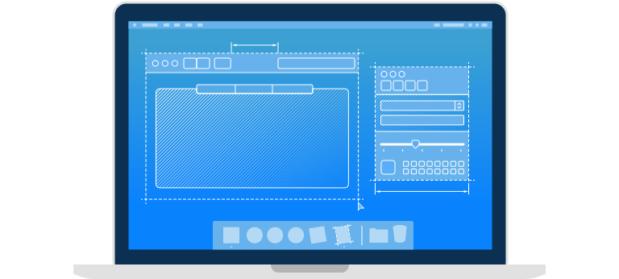

# macOS设计主题

四个主要主题将macOS App与iOS，tvOS和watchOS App区分开。当你想象App的特性时，请牢记这些主题。

## 灵活性

人们期望macOS App是直观的，同时通过自定义和灵活性来适应其工作流程。许多应用程序提供可配置的`偏好设置`，可自定义的界面以及完成任务的其他方式。`窗口`通常可以调整大小，界面元素可以隐藏或重新放置。可以从`工具栏`，`菜单`，`控件`，键盘快捷键，`触摸栏`，辅助功能等启动任务。灵活的应用程序通过可发现性促进学习。

## 扩展性

大型高分辨率显示器是大多数Mac用户的基本选择，人们通常通过连接其他显示器来扩展工作空间。App可以利用广泛的界面组件（例如`Tab选项卡`，`Sidebar侧边栏`，`Sheet表`和`Panel面板`）并支持沉浸式功能（例如全屏模式）来利用这种扩展性并提供价值。

## 功能性

Mac在硬件和软件方面都非常强大。App可以利用此功能来提供广泛的功能和工作流程，以满足各种简单，高级和特殊用户的需求。

## 专注性

macOS旨在保持当前任务的清晰性和重点。视觉对比度，半透明性和较大的阴影使其易于区分活动窗口和非活动窗口。界面把内容交给相关控件。在整个系统中，装饰都是微妙而恰当的。