# Visual Index

大多数macOS App是使用AppKit的组件构建的，AppKit是一种定义通用接口元素的编程框架。该框架使App可以在整个系统中实现一致的外观，同时提供高级定制。以下AppKit元素灵活而熟悉，它们会在系统引入外观更改时自动变化。

* [`窗口`和`视图`](#窗口和视图)
* [`菜单`](#菜单)
* [`按钮`](#按钮)
* [`字段`和`标签`](#字段和标签)
* [`选择器`](#选择器)
* [`指示器`](#指示器)
* [`触摸栏`控件和视图](#触摸栏控件和视图)

除了定义macOS的界面外，AppKit还定义了你的App可以使用的功能。 例如，通过此框架，你的App可以响应触控板上的手势，并启用绘图，可访问性和打印等功能。macOS也与GameKit，Metal，SceneKit和SpriteKit等其他编程框架和技术紧密集成，使你能够设计功能强大的App。

## `窗口`和`视图`

`窗口`包含一个或多个`视图`，其中包含人们在屏幕上看到的内容，包括文本，图形，动画和交互式元素。

### Alert

<embed src="./Alerts.svg" type="image/svg+xml" /> 

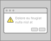

显示模态消息、错误或警告。

### Box

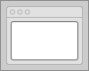

构成一个独特的、有逻辑分组的控件、文本字段和其他界面元素。

### Column view

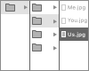

使用一系列垂直列来允许在数据层次结构中导航。

### Image view

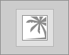

在透明或不透明背景上显示单个图像或动画序列。

### Outline view

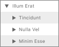

在包含单元格的滚动列表中显示数据层次结构，这些单元格被组织为列和行。

### Panel (HUD-style)

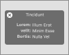

在高对比度视觉或沉浸式App中显示与活动文档或选择内容有关的控件，选项或信息。

### Panel (standard)

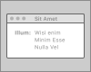

显示与活动文档或选择内容有关的控件，选项或信息。

### Popover

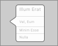

单击控件或视图时，在屏幕上的其他内容上方显示控件，选项或信息。

### Scroll view

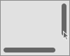

通过水平和垂直滚动，可以浏览大于可见区域的内容。

### Sheet

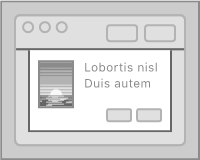

在`窗口`附带的模态`对话框`中显示控件，选项或信息。

### Sidebar

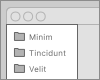

出现在`窗口`的一侧。对`窗口`的主要部分启用导航和选择要操作的项目。

### Split view

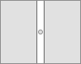

管理两个或多个内容窗格的呈现。

### Tab view

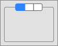

在同一区域中显示多个互斥的内容窗格。

### Table view

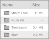

在包含单元格的滚动列表中显示数据，这些列表被组织为列和行。

### Toolbar

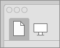

提供对App`窗口`中常用命令和功能的快速访问。

### Web view

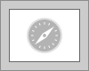

加载并显示丰富的Web内容，例如嵌入式HTML和网站。

### Window

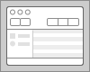

由框架区域和主体区域组成，可用于查看App中的内容并与之交互。

## `菜单`

菜单显示选项列表，例如命令、属性或状态。

### Contextual menu

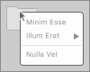

通过按住Control并单击某个项目来显示。提供对与当前上下文相关的常用命令的访问。

### Dock menu

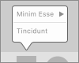

通过按住Control键并单击应用程序的Dock图标显示。 提供系统范围内对有用命令的访问。

### Menu bar menu

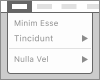

当你的应用程序位于最前面时，提供对应用程序特定命令访问的`菜单栏`。

## `按钮`

按钮可发起动作或让人们做出选择。

### Actions button

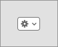

通常在`工具栏`或`表格`下找到。显示应用范围或特定于表的命令。类似于上下文菜单。

### Checkbox

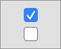

在两个相反的状态、动作或值之间选择。

### Disclosure button

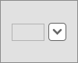

显示和隐藏与特定控件关联的功能，例如“保存”对话框中的“另存为”文本字段。

### Disclosure triangle

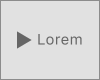

显示和隐藏与`视图`或展示项目列表相关的信息或功能。

### Gradient button

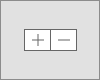

启动与特定`视图`相关的瞬时操作，例如添加或删除表行。

### Help button

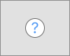

在系统提供的帮助查看器中打开特定于App的帮助文档。

### Image button

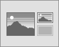

包含图像或图标，并启动特定于App的瞬时操作。

### Pop-up button

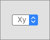

显示包含互斥选项列表的菜单。

### Pull-down button

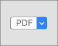

显示命令列表或启用一个或多个状态的选择。

### Push button

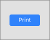

包含标题并启动特定于App的瞬时操作。

### Radio button

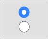

提供一组两个或多个互斥但相关的选择。

###  Scope button

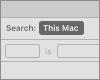

限制视图中内容的范围，例如搜索结果。

## `字段`和`标签`

`字段`和`标签`显示可编辑或静态信息。

### Combo box

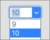

在单个控件中将文本字段与下拉按钮组合在一起。

### Label

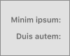

描述屏幕上的界面元素或提供短消息。

### Search field

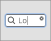

在大量值中启动基于文本的搜索。

### Text field

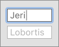

允许用户输入和编辑一行或多行文本。

### Token field

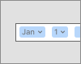

允许用户输入和编辑令牌，可以轻松选择和操作的文本块。

## `选择器`

选择器使人们可以选择特定的值，例如颜色，日期或文件。

### Color well

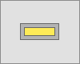

使用系统的颜色面板启用颜色选择。

### Date picker

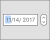

启用 日期/时间/日期和时间/日期范围 的文本或图形选择。

### Image well

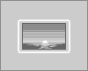

图像视图的可编辑版本。支持拖放，删除，复制和粘贴。

### Path control

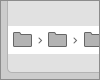

显示所选文件或文件夹的文件系统路径。

### Segmented control

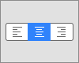

两个或多个段的水平集合，用作类似于按钮或切换，并影响相应的对象、状态或视图。

### Slider

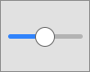

水平轨道，垂直轨道或圆形刻度盘。在值范围内启用细粒度选择。

### Stepper

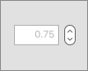

递增或递减数字，日期或时间值。

## `指示器`

指示器以图形方式传达级别或状态信息。

### Capacity indicator (continuous)

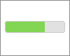

填充轨迹以说明与有限容量相关的当前水平。

### Capacity indicator (discrete)

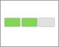

矩形段填充以说明与有限容量相关的当前水平。

### Progress bar

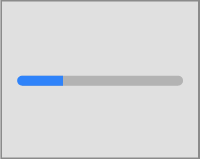

填充的条形图，显示已知持续时间的任务的进度。

### Progress circle

填充的一个圆，显示已知持续时间的任务的进度。

### Progress spinner

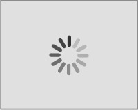

为无法量化的任务执行动画，例如加载或同步复杂数据。

### Rating indicator

使用一系列水平排列的图形符号来传达等级

### Relevance indicator

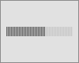

使用一系列竖线传达相关性。

## `触摸栏`控件和视图

这些界面元素使你的App可以呈现内容并响应macOS Touch Bar中的用户交互。

### Button

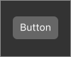

轻按时启动特定于App的操作。也可以用作拨动开关。

### Candidate list

在文本输入过程中提供自动完成建议。

### Character picker

打开一个弹出框，其中包含表情符号等特殊字符的列表。

### Color picker

打开一个弹出框，其中包含用于选择颜色的控件。

### Popover

样子为按钮。轻按时，将显示一个模态叠加层，其中包含一组瞬态控件。

### Scrubber (fixed)

左右滑动即可流畅浏览一组安排好的内容，例如打开Safari标签。

### Scrubber (free)

允许左右滑动以浏览可自由滚动的列表（如日历日期列表）中的内容。

### Segmented control

两个或多个段的水平集合，用作类似于按钮或切换，并影响相应的对象、状态或视图。

### Sharing service picker

显示包含用于与App、社交媒体帐户和其他服务共享内容的按钮的弹出框。

### Slider

水平轨道，垂直轨道或圆形刻度盘。 在值范围内启用细粒度选择。
