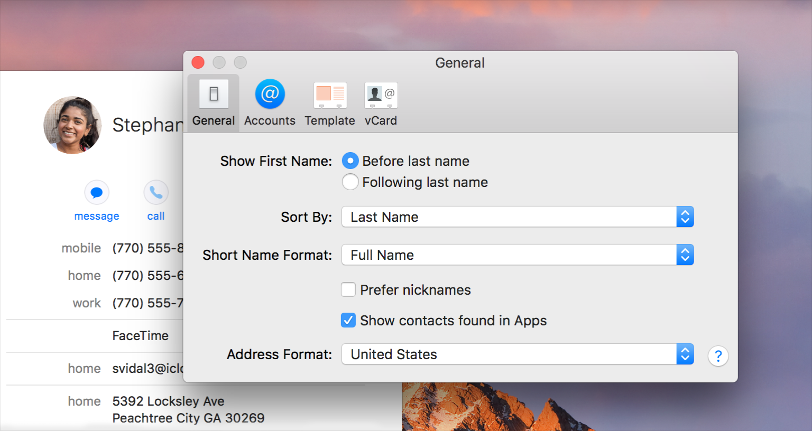

# 偏好设置

偏好设置是用户定义的设置，你的应用会在每个会话之间记住该设置。用户可以调整偏好设置以自定义应用程序的外观和行为。例如，Finder包括一些自定义设置，例如自定义桌面和侧边栏的外观，显示文件扩展名以及在清空垃圾箱时禁用警告。

**提供有限的有用的偏好设置。**避免包括用于配置应用程序各个方面的偏好设置。相反，应果断地专注于人们可能实际想要修改的功能和外观属性。

**提供特定于应用程序的偏好设置。**用户希望全局管理某些设置，例如侧边栏图标的大小，滚动行为和自动保存行为。这些设置已经可以在“系统偏好设置”中进行配置。为确保一致性并避免混淆，你的应用程序不应包含使应用程序的行为与系统中其他所有应用程序不同的偏好设置。

**为很少更改的设置保留偏好设置。**如果有人在每次打开你的应用程序或每次执行某些任务时可能想要更改设置，请考虑将这些设置暴露在浮动面板中，用户可以打开并保持在屏幕上以快速访问。

**提供菜单项（而非工具栏项）以访问你的应用程序的偏好设置。**工具栏仅适用于经常使用的物品。用户希望在“应用程序”菜单中找到应用程序级的偏好设置，并在“文件”菜单中找到文档级的偏好设置。还应使用标准的Command-逗号（，）键盘快捷方式访问应用程序级别的偏好设置。有关相关指导，请参见[工具栏]()和[菜单栏的菜单]()。

有关开发人员的指导，请参阅[偏好设置和设置编程指南]()和[Core Foundation的偏好设置编程的主题]()。

## 窗口的偏好设置

偏好设置窗口是一个无模式对话框，用于调整应用程序的偏好设置。通常，偏好设置窗口包含一个工具栏，该工具栏包含用于在相关设置组之间切换的按钮，这些按钮显示在工具栏下方的视图中。这些分组称为偏好设置窗格。

**立即应用偏好设置的更改。**用户期望偏好设置的更改在更改后立即生效。

**禁用“最小化”和“缩放”按钮。 **“偏好设置”窗口用于偶尔调整应用程序的行为，因此无需调整窗口的大小或长时间保持打开状态。

**确保工具栏始终可见且不可自定义。**使用偏好设置窗口的工具栏，可以在应始终可用的不同设置组之间进行导航。

**指示活动的工具栏按钮。**将选定的外观应用于当前可见的偏好设置窗格的工具栏按钮。

**更新窗口的标题以反映当前可见的偏好设置窗格。**例如，如果你的“偏好设置”窗口具有“常规”偏好设置窗格，则当该窗格处于活动状态时，其标题应为“常规”。如果你的窗口没有多个偏好设置窗格，则其标题应为“`应用程序名称`偏好设置”。

**恢复上次查看的偏好设置窗格。**如果用户切换偏好设置窗格，则你的应用应记住此更改，并在下次用户打开偏好设置窗口时立即显示相同的窗格。