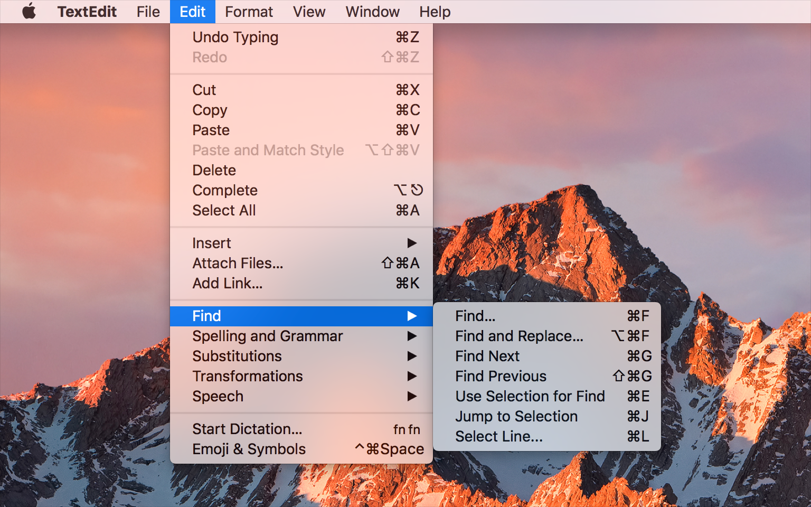

# 菜单栏的菜单

屏幕顶部的菜单栏为你的应用程序中的顶级菜单提供了一个主目录。这些菜单可以包括系统提供的标准菜单以及你的应用程序定义的自定义菜单。

菜单栏通常包括以下菜单，顺序如下。

* Apple menu - 苹果Logo
* App menu - 应用名称
* File menu - 文件
* Edit menu - 编辑
* Format menu - 格式
* View menu - 查看
* App-specific menus - 应用自定义的
* Window menu - 窗口
* Help menu - 帮助

The menu bar and its menus adopt vibrancy and can have a light or dark appearance. 这由用户的外观偏好设置决定。有关指导，请参见[半透明]()。

**始终遵循菜单设计最佳做法。**通常，所有菜单和菜单项都应一致地排列并拥有标题。请参阅[菜单剖析]()。

**实现标准的菜单和子菜单。**人们通常希望大多数都是标准菜单和菜单项，除非这些标准的菜单与你的应用无关。在许多情况下，系统会自动为你实现标准菜单项的行为和功能。例如，当用户在标准文本字段中选择文本时，将可以使用“编辑”>“复制”菜单项。

**为标准菜单项启用预期的键盘快捷键。**在所有应用程序中，标准菜单项（如复制，剪切，粘贴，保存和打印）的键盘快捷键应保持一致。

**仅为经常使用的自定义菜单项定义新的键盘快捷键。**人们很难记住他们不经常使用的命令的快捷方式。最小化特定于应用程序的键盘快捷键还有助于避免与可能存在的其他系统范围的键盘快捷键发生潜在冲突。

**考虑实现Dock菜单，当你的应用程序不在最前端时可以启动有用的操作。**除了系统提供的菜单项（例如用于打开或退出应用程序的菜单项）之外，Dock菜单还可以包含特定于应用程序的项，例如“新建文档”或“新事件”。当用户按住Control键并点击某个应用程序的Dock图标时，将出现Dock菜单。请参阅[Dock菜单]()。

**除了菜单栏菜单外，还考虑提供上下文菜单。**通过按住Control键并单击应用程序中的视图或选定元素，可以显示上下文菜单或快捷菜单。请参阅[上下文菜单]()。

**考虑提供附加菜单栏，以便在你的应用程序不在最前面时快速访问有用的操作。**许多菜单栏还提供有用的信息，例如备份状态或有关Wi-Fi连接的其他详细信息。请参阅[状态菜单](../Extensions/MenuBarExtras.md)。

## Apple Menu

Apple菜单包含始终可用的菜单项。此菜单的内容由系统定义，不能由你的应用修改。

## App Menu - 应用名称

应用程序菜单包括的菜单项应整体上适用于你的应用程序，而不是针对特定的文档或窗口。为了帮助人们快速识别活动的应用程序，菜单标题应该包括你的应用程序名称，并以粗体显示。

此菜单通常包含以下顶级菜单项，按以下顺序列出。

| 菜单项 | 功能 |
|:---|:-------|
| 关于`你应用的名称` | 显示应用程序的“关于”窗口，其中包括版权和版本信息。 |
| 偏好设置… | 如果你的应用程序具有偏好设置窗口，则打开你的应用程序的偏好设置窗口。请参阅[偏好设置]()。 |
|  |  |
|  |  |
|  |  |
|  |  |
|  |  |
|  |  |